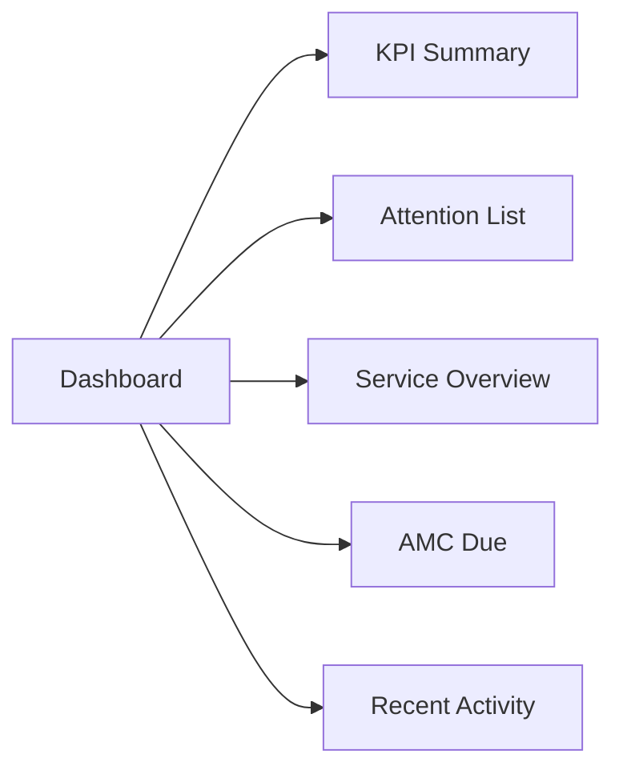
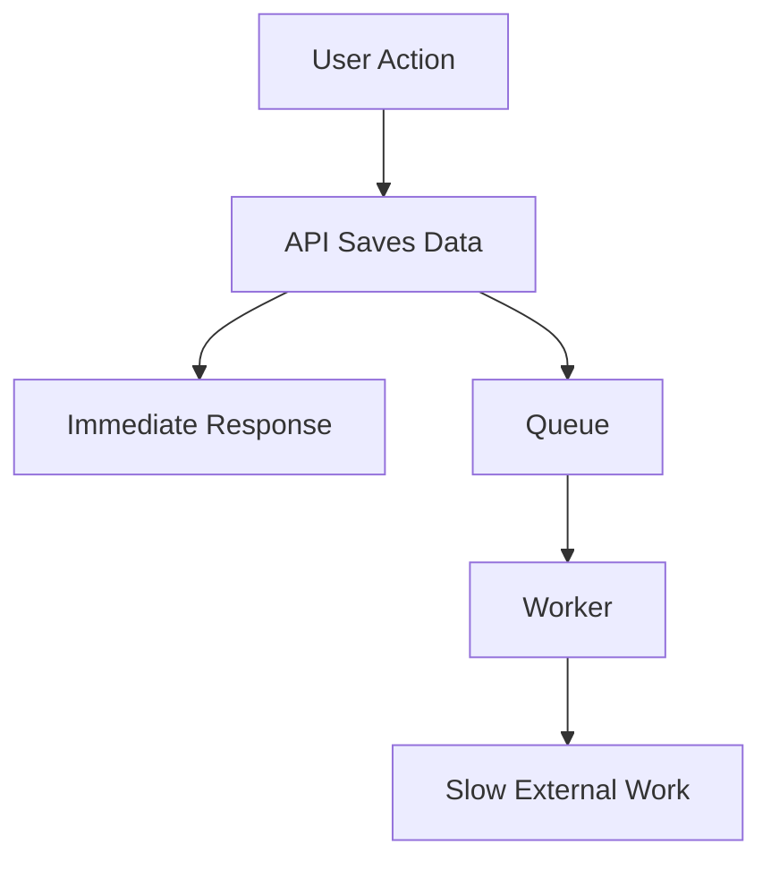

## `PERFORMANCE.md`

```md
# Airmech One — Performance Standards

**Product:** Airmech One  
**Built by:** Qeilvra

Performance is a core product requirement.

A feature is NOT complete if it works but noticeably slows down a core workflow.

---

# 1. Core Performance Rule

Never compromise software speed for:

- visual effects
- animations
- large libraries
- oversized API responses
- loading complete datasets
- unnecessary database calls
- convenience shortcuts
- heavy client-side processing

Performance must be considered in:

- frontend
- backend
- database
- search
- dashboard
- reports
- mobile
- background jobs
- file handling

---

# 2. Main Targets

These are engineering targets, not client SLA guarantees.

```text
Common API read
p95 <= 300ms where practical

Filtered table
p95 <= 700ms

Global search
useful results <= 1 second

Dashboard
critical content should become usable quickly

Large reports
asynchronous

PDF generation
asynchronous

Bulk notifications
asynchronous
```

---

# 3. Web Performance Targets

Aim for strong Core Web Vitals:

```text
LCP <= 2.5s
INP <= 200ms
CLS <= 0.1
```

These should be measured at realistic production conditions.

---

# 4. Frontend Rules

## Do

- use route-level code splitting
- lazy-load heavy components
- lazy-load charts
- paginate large tables
- debounce search
- fetch only required data
- cache stable reference data where safe
- compress images
- use skeleton/loading states
- keep bundle size controlled
- use lightweight components

## Avoid

- loading hidden tabs automatically
- fetching full histories on page load
- rendering hundreds of rows at once
- large icon libraries
- oversized chart libraries
- unnecessary client-side state
- duplicate requests
- large remote fonts
- heavy animations

---

# 5. Table Performance

Every large table must support:

```text
page
limit
search
filter
sort
```

Example:

```http
GET /complaints?page=1&limit=25&status=OPEN&priority=HIGH
```

Avoid:

```http
GET /complaints/all
```

for production lists.

---

# 6. API Response Rules

APIs should return only what the screen needs.

Bad:

```text
Customer
+ all sites
+ all assets
+ all complaints
+ all work orders
+ all documents
+ all history
```

Better:

```text
Customer summary
+ required counts
+ current page data
```

Load detailed sections only when requested.

---

# 7. Database Performance

Use indexes intentionally.

Likely indexed fields:

```text
customer_code
customer_name
phone
email

enquiry_status
follow_up_date

quotation_status
quotation_validity

project_status

asset_code
serial_number

complaint_status
complaint_priority

assigned_engineer_id
scheduled_at

amc_expiry
maintenance_date

created_at
```

Do not create indexes on every column automatically.

Indexes improve reads but increase:

- write cost
- storage
- maintenance overhead

---

# 8. Slow Query Investigation

If a query is slow:

```text
1. Measure query duration
2. Inspect execution plan
3. Check filters
4. Check joins
5. Check selected columns
6. Check indexes
7. Check result size
8. Optimize
9. Measure again
```

Do not guess.

---

# 9. N+1 Rule

Avoid:

```text
Load 100 complaints
↓
Run separate customer query for each complaint
↓
100 extra queries
```

Prefer:

- optimized joins
- batching
- preloading only required relationships

---

# 10. Dashboard Performance

Do not build:

```text
GET /dashboard
→ 30 sequential DB queries
→ one huge response
```

Prefer independent sections:



One slow widget must not block the whole dashboard.

---

# 11. Search Performance

Global search should support:

- customer
- contact
- phone
- email
- enquiry
- quotation
- project
- complaint
- work order
- asset
- serial
- engineer
- AMC

Rules:

- exact IDs should rank first
- use indexed fields
- limit results per category
- load more on demand
- do not scan full tables synchronously

---

# 12. Background Processing

The following must normally run outside the main request:

```text
PDF generation
Excel export
CSV export
Email sending
WhatsApp sending
AI processing
Image processing
Bulk import
AMC schedule generation
Large reports
Scheduled reminders
```

Flow:



---

# 13. Mobile Performance

Engineers may use weak mobile internet.

Mobile must:

- use small payloads
- compress photos
- show upload progress
- support retry
- preserve typed notes on recoverable failures
- avoid downloading full asset history automatically
- avoid large tables
- lazy-load documents/images

---

# 14. File Upload Performance

For photos/documents:

- validate before upload
- compress images where appropriate
- upload directly to object storage where possible
- show progress
- retry safely
- avoid sending large files through unnecessary backend memory buffers

---

# 15. Reports

Large reports should not block UI.

Flow:

```text
User requests report
↓
Report job created
↓
User continues working
↓
Worker generates report
↓
Notification appears
↓
User downloads report
```

---

# 16. Caching

Use caching only when safe.

Possible candidates:

- static reference lists
- role definitions
- equipment categories
- dashboard summaries
- frequently-read configuration

Do not cache data blindly if users require immediate consistency.

---

# 17. Pagination

Use cursor or page-based pagination depending on need.

For activity/history feeds, cursor pagination may be better.

For business tables:

```text
page + limit
```

is acceptable.

Never return unlimited histories.

---

# 18. Mobile vs Desktop

Desktop may show:

- larger tables
- split views
- more simultaneous information

Mobile should show:

- compact summaries
- drill-down screens
- tabs
- task-focused data

Do not copy large desktop layouts onto mobile.

---

# 19. Performance Monitoring

Track:

```text
API latency
Database query duration
Error rate
Queue delay
Worker failures
Page load time
Search latency
Upload duration
Report generation time
```

Use request IDs for correlation.

---

# 20. Performance Regression Rule

Any release that causes a major regression in:

- page load
- API latency
- DB query duration
- bundle size
- memory
- mobile responsiveness
- queue delay

must be investigated before release.

---

# 21. Performance Test Data

Before production, test with realistic scale.

Example test scale:

```text
Thousands of customers

Thousands of sites

Tens of thousands of assets

Tens of thousands of complaints

Multi-year work order history

Large document volume

Multiple simultaneous users
```

Exact scale should be updated after client discovery.

---

# 22. Release Performance Gate

A release fails performance review if it introduces:

- unbounded list endpoint
- full-table fetch
- repeated N+1 pattern
- large synchronous PDF/export
- heavy provider call inside user request
- obvious bundle bloat
- slow search without mitigation
- dashboard blocking on noncritical data

---

# 23. Final Performance Principle

Always prefer:

```text
Measured > Assumed

Pagination > Loading everything

Indexed queries > Full scans

Background jobs > Blocking users

Small responses > Huge payloads

Lazy loading > Preloading everything

Fast workflows > Decorative effects
```
```

