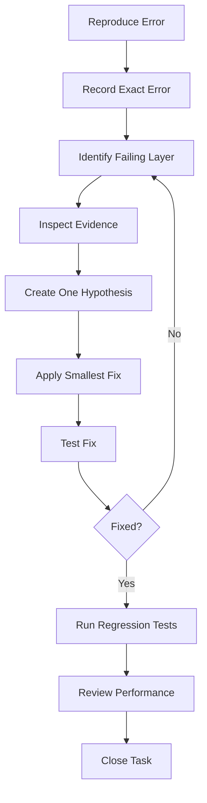
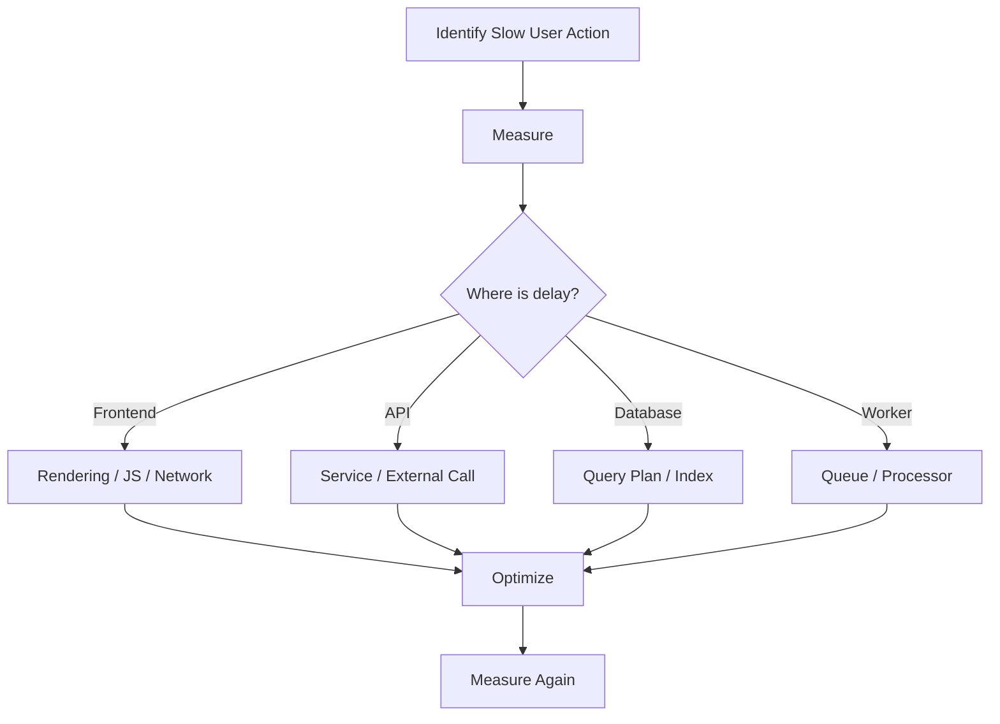

```md
# Airmech One — Engineering Rules

**Product:** Airmech One  
**Built by:** Qeilvra

This file defines how developers and AI coding agents must work on this project.

These rules are mandatory.

---

# 1. Core Rule

## Never compromise software speed

Performance is part of correctness.

Do not trade software speed for:

- unnecessary animations
- visual effects
- development shortcuts
- oversized libraries
- huge API responses
- unnecessary database queries
- loading complete datasets
- excessive client-side processing

A feature is NOT complete if it works but noticeably slows a core workflow.

---

# 2. Read Before Coding

Before changing code, read:

1. `MEMORY.md`
2. `PRD.md`
3. `RULES.md`
4. `DESIGN.md`
5. `ARCHITECTURE.md`
6. `PERFORMANCE.md`
7. `SECURITY.md`
8. `FEATURES.md`
9. `WORKFLOWS.md`
10. `TASK.md`
11. `ROADMAP.md`

Then inspect the existing code.

Do not immediately generate code.

---

# 3. Before Starting Any Task

Follow:

```text
Understand requirement
        ↓
Find existing implementation
        ↓
Identify owning module
        ↓
Check permissions
        ↓
Check database impact
        ↓
Check performance impact
        ↓
Check mobile + desktop behavior
        ↓
Implement smallest complete change
        ↓
Test
        ↓
Review
```

Before creating something new, search whether it already exists.

Do not create:

- duplicate components
- duplicate services
- duplicate utilities
- duplicate APIs
- duplicate database models

---

# 4. TypeScript Rules

TypeScript strict mode must remain enabled.

```json
{
  "compilerOptions": {
    "strict": true
  }
}
```

## Do

Use:

- explicit domain types
- enums/unions for known states
- `unknown` for untrusted values
- schema validation for incoming data
- typed API responses

Example:

```ts
type ComplaintStatus =
  | "RECEIVED"
  | "ASSIGNED"
  | "IN_PROGRESS"
  | "WAITING_PART"
  | "RESOLVED"
  | "CLOSED";
```

## Avoid

Do not use:

```ts
any
```

as a default solution.

Do not disable TypeScript errors simply to make the build pass.

Bad:

```ts
const data: any = response;
```

Better:

```ts
const data: ComplaintResponse = response;
```

---

# 5. Module Ownership

Each domain owns its own business rules.

```text
Customers
→ customer information

Quotations
→ quotation revisions and approvals

Assets
→ equipment identity/history

Complaints
→ complaint lifecycle

Warranty
→ warranty eligibility

Work Orders
→ engineer work execution

AMC
→ maintenance scheduling
```

Do not directly modify another module's private state.

Bad:

```text
AMC module directly updates complaint table.
```

Better:

```text
AMC module
→ calls Complaint service
→ Complaint module validates change
→ Complaint module updates its own state
```

---

# 6. Keep Controllers Thin

Controllers should mainly:

1. receive request
2. validate authentication
3. call service
4. return response

Bad:

```text
Controller
→ 200 lines business logic
→ database calls
→ email
→ PDF
→ notifications
```

Better:

```text
Controller
    ↓
Service
    ↓
Repository
```

Slow side effects:

```text
Service
    ↓
Queue
    ↓
Worker
```

---

# 7. Validation Rules

Validate all external input.

Validation includes two levels:

## Syntax validation

Examples:

```text
Is email valid?
Is date valid?
Is ID correctly formatted?
Is string within maximum length?
Is priority one of allowed values?
```

## Business validation

Examples:

```text
Can a CLOSED complaint be assigned?

Can this engineer accept another job?

Can this quotation revision be approved?

Is warranty still active?

Does this user have access to this customer?
```

Client-side validation improves UX.

Server-side validation is mandatory.

Never trust browser input.

---

# 8. Authorization Rules

Authentication:

```text
Who is the user?
```

Authorization:

```text
What is the user allowed to do?
```

These are different.

Always enforce authorization on the server.

Example:

```text
Engineer authenticated
        ↓
Has workorder.read permission?
        ↓
Is engineer allowed to access THIS work order?
        ↓
Allow / Deny
```

Checking only the role is not enough.

Also check access to the requested object.

---

# 9. Error Handling Philosophy

Errors belong to two categories.

## Expected errors

Examples:

- invalid form input
- engineer unavailable
- quotation expired
- record not found
- permission denied
- complaint already closed

These must return useful responses.

## Unexpected errors

Examples:

- programming bug
- database unexpectedly unavailable
- unknown exception
- infrastructure failure

These must:

- be logged internally
- show safe fallback UI
- include a request/correlation ID
- never expose internal technical details

---

# 10. Error Response Format

Use stable error codes.

Example:

```json
{
  "error": {
    "code": "ENGINEER_NOT_AVAILABLE",
    "message": "The selected engineer is not available at this time.",
    "requestId": "req_123",
    "fieldErrors": null
  }
}
```

Frontend logic may use:

```text
ENGINEER_NOT_AVAILABLE
COMPLAINT_ALREADY_CLOSED
QUOTATION_EXPIRED
PERMISSION_DENIED
CUSTOMER_NOT_FOUND
INVALID_STATE_TRANSITION
```

Do not make frontend code depend on parsing human-readable error text.

---

# 11. User Error Messages

Never show only:

```text
Something went wrong.
```

when the system knows what happened.

Bad:

```text
Error.
```

Better:

```text
The work order could not be assigned because Engineer A is already scheduled for another job.

Choose another engineer or change the visit time.
```

Good errors explain:

```text
WHAT happened
+
WHY where appropriate
+
WHAT the user can do next
```

---

# 12. Never Leak Technical Errors

Users must never see:

- stack traces
- SQL
- database credentials
- storage keys
- API keys
- server filesystem paths
- environment variables
- internal service details

Technical details belong in logs.

User receives a safe message and request ID.

---

# 13. Error-Solving Process

Do not randomly change code until the error disappears.

Use this process:



---

# 14. Step 1 — Reproduce

Record:

```text
User
Role
Action
Record ID
Environment
Expected result
Actual result
Error message
Request ID
```

Do not fix something you cannot reproduce or understand unless production urgency requires mitigation first.

---

# 15. Step 2 — Identify the Layer

Classify the problem.

Possible layers:

```text
Frontend
Validation
Authentication
Authorization
API
Business Rule
Database
Queue
Worker
Storage
External Integration
Network
Configuration
Deployment
Performance
```

Example:

```text
Button does nothing
```

could actually be:

```text
Frontend
→ request sent
→ API receives
→ API returns 403
```

Do not assume the visible layer caused the problem.

---

# 16. Step 3 — Inspect Evidence

Check:

- browser network request
- API status code
- server logs
- request ID
- database query
- database state
- queue job
- worker logs
- external provider response
- environment configuration

Use evidence before modifying code.

---

# 17. Step 4 — Create One Hypothesis

Example:

```text
Hypothesis:

Engineer assignment fails because the availability query uses the wrong time zone.
```

Test that hypothesis.

Do not change five unrelated things simultaneously.

---

# 18. Step 5 — Smallest Correct Fix

Fix the root cause.

Avoid large refactors while fixing a small bug.

Bad:

```text
Bug in engineer availability
→ rewrite entire scheduling module
```

Better:

```text
Identify faulty scheduling calculation
→ fix calculation
→ add test
```

---

# 19. Step 6 — Prevent Recurrence

After fixing a bug, decide whether it needs:

- unit test
- integration test
- validation
- database constraint
- monitoring
- improved error handling

Example:

Bug:

```text
AMC jobs generated twice.
```

Fix:

```text
Correct scheduler
+
idempotency protection
+
unique DB constraint
+
test
```

---

# 20. Logging Rules

Logs should help answer:

```text
What happened?
When?
Which request?
Which user?
Which entity?
Which service?
What failed?
```

Useful fields:

```text
timestamp
level
requestId
userId
action
entityType
entityId
duration
status
errorCode
```

Log important events including:

- authentication failures
- authorization failures
- input validation failures
- unexpected errors
- failed background jobs
- critical configuration failures

Do NOT log:

- passwords
- access tokens
- refresh tokens
- API secrets
- database passwords
- sensitive document contents

---

# 21. Database Rules

## Always

- use foreign keys
- use constraints
- use migrations
- use indexes where queries require them
- use transactions for atomic operations
- paginate large datasets
- inspect slow queries

## Never

- fetch entire production tables
- create indexes on every column blindly
- perform repeated N+1 queries
- perform destructive migration without a recovery plan

Indexes improve reads but add storage/write overhead.

Create them intentionally.

---

# 22. Slow Query Rule

If an important query is slow:

```text
1. Measure query
2. Inspect execution plan
3. Check filters
4. Check joins
5. Check indexes
6. Check selected columns
7. Check number of rows
8. Optimize
9. Measure again
```

Do not guess that adding an index automatically fixes every performance problem.

---

# 23. Transaction Rules

Use database transactions when several operations must succeed together.

Example:

```text
Assign Engineer

BEGIN

Create assignment
Update work order
Add audit event

COMMIT
```

If one fails:

```text
ROLLBACK
```

Keep transactions short.

Do not make external API calls inside long-running transactions.

---

# 24. API Performance Rules

Every potentially large endpoint must support:

```text
page
limit
search
sort
filter
```

Good:

```text
GET /complaints?page=1&limit=25&status=OPEN
```

Avoid:

```text
GET /complaints/all
```

Do not return large nested relationships unless required.

---

# 25. Background Job Rules

Use background workers for:

- PDF generation
- Excel exports
- email
- WhatsApp
- AI calls
- image processing
- bulk imports
- AMC schedule generation
- large reports

Flow:

```text
User action
    ↓
Save business data
    ↓
Return success
    ↓
Queue job
    ↓
Worker performs slow work
```

The user should not wait for an email provider or PDF renderer to finish.

---

# 26. Retry Rules

Retry only errors likely to be temporary.

May retry:

```text
provider timeout
temporary storage failure
network failure
temporary 5xx provider failure
```

Do NOT retry:

```text
permission denied
invalid form input
invalid business state
record not found
bad credentials
```

Retries must have:

- maximum attempts
- delay/backoff
- logging
- final failure state

Background jobs should be idempotent where possible.

---

# 27. Frontend Rules

## Do

- separate feature logic
- use loading states
- use empty states
- use proper error states
- preserve entered form data
- prevent accidental double submit
- fetch only necessary data
- use route-based code splitting
- lazy-load heavy modules

## Avoid

- massive page components
- business logic inside UI components
- unnecessary global state
- loading hidden tabs
- fetching entire histories
- excessive rerenders

---

# 28. Mobile Rules

Mobile must contain the same permitted business capabilities as desktop.

But:

**Do not make mobile simply a vertically stacked desktop interface.**

Use:

- bottom navigation
- tabs
- drill-down screens
- drawers
- sheets
- sticky actions
- compact summaries
- full-screen search
- full-screen filters

Desktop:

```text
Complaint List | Complaint Detail | Engineer Panel
```

Mobile:

```text
Complaint List
      ↓
Complaint Detail
      ↓
Overview | Timeline | Work Order | Asset
      ↓
Sticky actions
```

---

# 29. UI Performance Rules

Do not use UI effects that make work slower.

Avoid:

- large animations
- unnecessary transitions
- huge chart libraries
- giant icon packages
- decorative videos
- heavy remote fonts
- rendering hundreds of rows

Core Web performance targets:

```text
LCP ≤ 2.5s
INP ≤ 200ms
CLS ≤ 0.1
```

Treat these as engineering targets, not client SLA guarantees.

---

# 30. Security Rules

Always:

- validate input
- authenticate users
- authorize every sensitive operation
- protect documents
- use least privilege
- protect secrets
- audit important actions
- use secure sessions
- review dependencies

Never:

- trust frontend permission checks
- expose secret values
- commit `.env`
- create public confidential document URLs
- trust uploaded file names/types blindly

---

# 31. File Upload Rules

Validate:

- file size
- file type
- file extension
- authorization
- destination/entity

Use generated storage keys.

Do not trust the original filename as a storage path.

Private business files must remain private.

---

# 32. Dependency Rules

Before installing a package ask:

```text
Do we actually need it?

Can the platform already do this?

Is it actively maintained?

How large is it?

Does it affect browser bundle size?

Does it introduce security risk?

Will we depend heavily on it?
```

Do not install a large dependency for a tiny helper function.

---

# 33. Git Rules

Use branches.

Examples:

```text
feat/complaint-assignment
feat/customer-360
fix/amc-duplicate-jobs
perf/customer-search
security/document-access
```

Do not work directly on production/main for normal development.

---

# 34. Commit Rules

Use clear commits.

Format:

```text
type(scope): description
```

Examples:

```text
feat(complaints): add engineer assignment

fix(amc): prevent duplicate maintenance jobs

perf(search): add indexed asset lookup

security(documents): enforce download permissions

refactor(customers): simplify contact mapper

test(warranty): add expiry rule tests
```

Prefer small commits with one clear purpose.

---

# 35. Pull Request Rules

Before merging:

- review changed files
- understand every change
- run tests
- run TypeScript checks
- run lint
- inspect migrations
- review dependency changes
- check security
- check performance
- test mobile when UI changed

Do not merge because:

```text
"It seems to work."
```

---

# 36. Testing Rules

## Unit tests

Use for:

- business rules
- calculations
- state transitions
- permission logic

## Integration tests

Use for:

- database repositories
- transactions
- module interaction

## End-to-end tests

Critical flows:

```text
Login

Customer creation

Enquiry
→ Quotation

Quotation
→ Project

Complaint
→ Engineer
→ Work Order
→ Resolution
→ Closure

AMC
→ PM
→ Work Order
```

---

# 37. State Transition Rules

Do not let frontend freely change workflow status.

Bad:

```text
PATCH complaint
status = CLOSED
```

Better:

```text
POST /complaints/:id/close
```

Backend then checks:

```text
permission
current state
required information
customer confirmation
open work orders
```

---

# 38. Data Deletion Rules

Do not permanently delete important operational records by default.

Prefer:

```text
archive
soft delete
inactive
cancelled
```

for important business history.

Permanent deletion should require explicit rules and permissions.

---

# 39. Audit Rules

Audit important actions.

Examples:

```text
COMPLAINT_ASSIGNED
COMPLAINT_REOPENED
COMPLAINT_CLOSED

WORK_ORDER_COMPLETED

WARRANTY_OVERRIDDEN

QUOTATION_APPROVED

USER_ROLE_CHANGED

AMC_UPDATED
```

Store:

```text
actor
action
entity
entity ID
previous value
new value
timestamp
request ID
```

---

# 40. AI Coding Agent Rules

AI must NOT immediately start generating large amounts of code.

Before implementing:

```text
Read docs
↓
Inspect repository
↓
Search existing implementation
↓
Identify module
↓
Identify requirement
↓
Implement smallest correct change
```

AI must not:

- invent business requirements
- invent duplicate database models
- delete working code without reason
- weaken security
- bypass TypeScript
- ignore tests
- compromise performance
- mark unfinished tasks complete

---

# 41. When AI Must Stop and Ask

Do not guess when uncertainty affects:

- permissions
- money
- invoices
- quotation approval
- permanent data deletion
- warranty decisions
- major architecture changes
- irreversible database migrations
- Phase 1 vs Phase 2 scope
- customer-facing legal behavior

---

# 42. Performance Investigation Rule

If software becomes slow:



Never optimize blindly.

Measure before and after.

---

# 43. Definition of Done

A task is NOT complete merely because the happy path works.

A task is DONE when:

- requirement works
- desktop works
- mobile works
- permission rules work
- validation works
- error states work
- loading states work
- tests pass
- TypeScript passes
- lint passes
- database migration is safe
- audit added where required
- security reviewed
- performance reviewed
- TASK.md updated

---

# 44. Final Engineering Principle

Always prefer:

```text
Clear > Clever

Simple > Over-engineered

Measured > Assumed

Explicit > Magical

Small changes > Giant rewrites

Root-cause fixes > Error hiding

Server authorization > UI-only checks

Background jobs > Blocking users

Indexed pagination > Loading everything

Reliable workflows > Decorative features

Performance > Unnecessary effects
```

Airmech One is operational business software.

Reliability, speed, traceability, security and clarity come first.
```

A few important rules here are directly grounded in the official guidance: TypeScript's `strict` mode increases type-checking guarantees; OWASP recommends validating both input syntax and business semantics and keeping authorization separate from authentication; PostgreSQL explicitly notes that indexes improve retrieval but also introduce overhead; Next.js distinguishes expected errors from uncaught exceptions and supports route-level error boundaries; and GitHub's PR workflow is built around review plus automated checks before merging. :chatgpt-content-reference{index="1"}