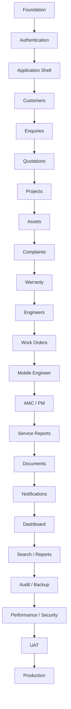

# Airmech One — Development Task Plan

**Product:** Airmech One  
**Built by:** Qeilvra

This file defines the implementation order, task status, dependencies, and acceptance checks for the complete project.

---

# 1. Core Rule

**Do not compromise software speed at any stage.**

Every completed task must be checked for:

- performance
- security
- permissions
- desktop behavior
- mobile behavior
- error handling
- loading states
- data safety

A feature is not complete if it works but makes the system noticeably slower.

---

# 2. Task States

Use only:

```text
BACKLOG
READY
IN_PROGRESS
BLOCKED
REVIEW
DONE
```

Example:

```text
[TASK-031] Complaint Assignment
Status: IN_PROGRESS
```

---

# 3. Before Starting Any Task

Before coding:

```text
Read project docs
      ↓
Understand requirement
      ↓
Inspect existing code
      ↓
Find owning module
      ↓
Check database impact
      ↓
Check permissions
      ↓
Check desktop + mobile UX
      ↓
Check performance risk
      ↓
Implement
      ↓
Test
```

Read:

1. `MEMORY.md`
2. `PRD.md`
3. `RULES.md`
4. `DESIGN.md`
5. `ARCHITECTURE.md`
6. `PERFORMANCE.md`
7. `SECURITY.md`
8. `FEATURES.md`
9. `WORKFLOWS.md`
10. `TASK.md`
11. `ROADMAP.md`

---

# 4. Definition of Ready

A task becomes `READY` when:

- requirement is understood
- module owner is identified
- dependencies are complete
- permissions are understood
- database impact is understood
- desktop behavior is defined
- mobile behavior is defined
- acceptance criteria exist
- no major unanswered business question remains

---

# 5. Definition of Done

A task is `DONE` only when:

- functionality works
- desktop works
- mobile works
- mobile is not just vertically stacked desktop
- permissions work
- validation works
- loading state exists
- empty state exists
- error state exists
- tests pass
- TypeScript passes
- lint passes
- database migration is safe
- audit is added where required
- performance is acceptable
- security is reviewed
- no unnecessary requests are added
- `TASK.md` status is updated

---

# 6. Phase 0 — Project Foundation

## TASK-001 — Create Monorepo

**Status:** DONE

Owner: repository foundation. No business data, role grants, or production integrations are introduced by this task.
Dependencies: documentation review and complete repository inspection (completed 5 October 2026).
Implementation and verification plan: `docs/implementation-plan.md`.

Verified 5 October 2026: initial and frozen-lockfile installation, all app/package
builds, strict typechecking, lint, and formatting passed. Nine unit/integration
tests, three compiled startup tests, and six desktop/tablet/mobile browser checks
passed. Dependency audit reported zero advisories. Independent foundation review
found no remaining TASK-001 blocker.

Evidence and scope limits: `docs/verification/task-001.md`.
Status progression: READY → IN_PROGRESS → REVIEW → DONE.
Next READY task: TASK-002. Later operational/infrastructure tasks remain pending.

Create:

```text
apps/
├── web/
├── api/
└── worker/

packages/
├── ui/
├── contracts/
├── database/
├── config/
└── testing/
```

Acceptance:

- project installs
- all apps build
- shared packages resolve correctly

---

## TASK-002 — TypeScript Configuration

**Status:** DONE

Verified 5 October 2026: shared strict presets cover all three applications,
all five packages, and root TypeScript tooling. Typecheck, lint, formatting,
tests, and complete production builds passed with dependency declaration checks
enabled. Existing TASK-001 checks passed: nine unit/integration tests, three
compiled startup tests, and six desktop/tablet/mobile browser tests.

Evidence, config structure, package boundaries, and compatibility follow-up:
`docs/verification/task-002.md`.
Status progression: READY → IN_PROGRESS → REVIEW → DONE.
Next READY task: TASK-003 — Code Quality. No later task was started.

Requirements:

- strict mode
- shared config
- no unnecessary `any`
- path aliases

---

## TASK-003 — Code Quality

**Status:** DONE

Verified 5 October 2026: one shared ESLint architecture covers all applications
and packages, with typed async/safety checks, React/Next.js rules, and import
boundaries. Prettier and strict TASK-002 TypeScript configuration are preserved.
The complete quality gate passed from clean build artifacts: all eight workspace
builds, typecheck, lint, formatting, 17 unit/integration tests, three startup
tests, six browser checks, and a clean dependency audit. Existing tests passed.

Evidence, commands, scoped dependency compatibility patch, and follow-up notes:
`docs/verification/task-003.md`.
Status progression: READY → IN_PROGRESS → REVIEW → DONE.
Next READY task: TASK-004 — Environment Configuration. No later task was started.

Configure:

- ESLint
- formatting
- type checking
- unit testing
- integration testing

---

## TASK-004 — Environment Configuration

**Status:** IN_PROGRESS

Create validated environment handling for:

```text
DATABASE_URL
REDIS_URL
AUTH_SECRET
OBJECT_STORAGE
EMAIL
OBSERVABILITY
```

Never expose secrets to frontend code.

---

## TASK-005 — PostgreSQL

**Status:** DONE

Real Supabase acceptance passed on 5 October 2026 with the supplied trusted CA:
strict TLS, safe typed queries, backend reuse, infrastructure migration application,
zero-change replay and exact ledger checksum verification. Live database tests and
server/browser boundary checks passed. Credentials and CA remain ignored locally;
no authentication or business tables were created. Evidence:
docs/verification/task-005.md.

Set up:

- database
- migrations
- connection pooling
- development seed strategy

---

## TASK-006 — Redis / Job Queue

**Status:** DONE

Verified 5 October 2026: lazy API BullMQ producer → Redis → compiled worker
processed `system.healthcheck`; bounded retries/backoff, failure retention,
idempotent IDs, unavailable Redis handling and owned-process cleanup passed.
Eight queue unit tests and four live Redis tests passed. The complete root
quality gate and advisory audit passed. No business jobs or HTTP routes added.
Evidence: `docs/verification/task-006.md`.

Required for:

- emails
- PDFs
- exports
- AMC jobs
- later WhatsApp
- later AI

---

## TASK-007 — Object Storage

**Status:** DONE

Live Supabase acceptance passed on 5 October 2026 using the sole existing private
bucket: generated-key upload, metadata, public/anonymous denial, matching signed
download, actual expiry, exact-object deletion and empty test-prefix confirmation.
Secrets and bucket selection are local only. Deny-default authorization and
bounded streaming remain intact. Evidence: docs/verification/task-007.md.

Support private files:

- documents
- photos
- service reports
- quotation PDFs

---

## TASK-008 — CI Pipeline

**Status:** DONE

GitHub foundation run 37298345682 passed all steps for commit dfdf34b on main:
frozen install, complete quality gate, browsers, disposable PostgreSQL migrations
and live PostgreSQL/Redis verification. Logs contain none of the configured local
secrets. Existing HTTPS Git credentials work; the earlier SSH blocker is resolved.
Evidence: docs/verification/task-008.md.

Run on every PR:

```text
install
typecheck
lint
tests
build
```

There is no TASK-009. TASK-010 is the next planned task after the completed
infrastructure batch. No authentication or business module was started.

---

# 7. Phase 1 — Authentication & Users

## TASK-010 — User Model

Status: DONE — model, typed repository and real disposable PostgreSQL tests passed
in hosted CI. See `docs/verification/task-010.md`.

Create:

- user
- status
- employee details
- role relation
- last login

---

## TASK-011 — Roles

Status: DONE — eight role records and relations verified in actual hosted
PostgreSQL, without implicit grants. See `docs/verification/task-011.md`.

Create:

```text
Super Admin
Management
Sales/Admin
Service Manager
Engineer
Project Manager
Accounts
Store
```

---

## TASK-012 — Permissions

Status: BLOCKED — permission catalog and deny-by-default checks are prepared;
approved role grants and object visibility/ownership are not confirmed.

Examples:

```text
customer.read
customer.write

quotation.create
quotation.approve

complaint.create
complaint.assign
complaint.resolve
complaint.close

workorder.read
workorder.update_own

report.export
admin.users
```

---

## TASK-013 — Login

Status: BLOCKED — Supabase Auth is the assessed identity provider; controlled
identity provisioning, deployment/session policy and real login verification
remain unavailable. No substitute authentication system was created.

Implement:

- login
- logout
- sessions
- invalid credentials
- disabled account handling

---

## TASK-014 — Password Reset

Status: BLOCKED — approved redirect origin, email/reset provider configuration
and a controlled identity are required for actual recovery verification.

Include:

- secure reset token
- expiry
- invalid-token state

---

## TASK-015 — User Administration

Status: BLOCKED — first-administrator provisioning and permitted role assignment,
role management and account administration require the approved access policy.

Admin can:

- create user
- edit user
- disable user
- assign roles

---

## TASK-016 — Authorization Guards

Status: BLOCKED — explicit permission/object checks deny by default; authenticated
identity integration and approved object policies are required before protected
endpoints can be completed.

Backend must enforce all protected actions.

Frontend permission checks are for UX only.

---

## TASK-017 — Authentication Audit

Status: BLOCKED — append-only audit storage is prepared; actual login/reset,
disable and role-change event producers depend on the blocked authentication
and administration flows.

Track:

```text
LOGIN_SUCCESS
LOGIN_FAILED
PASSWORD_RESET
USER_DISABLED
ROLE_CHANGED
```

---

# 8. Phase 2 — Application Shell

## TASK-020 — Desktop Layout

Status: BLOCKED — shared UI can proceed; actual authenticated user menu,
role-aware workspace navigation and protected search require TASK-012–016.

Build:

```text
Sidebar
Top Bar
Global Search
Notifications
User Menu
Page Workspace
```

Follow `DESIGN.md`.

---

## TASK-021 — Mobile Navigation

Status: BLOCKED — role-aware mobile navigation requires the approved access
policy and current authenticated profile. Mobile shared controls proceed separately.

Build mobile-specific navigation.

Recommended:

```text
Home
Work
Customers
Search
More
```

Do NOT simply collapse desktop sidebar.

---

## TASK-022 — Responsive Layout System

Status: BLOCKED — responsive shared controls are implemented; integration of the
actual desktop/mobile protected shell depends on TASK-020–021.

Support:

```text
Mobile
Tablet
Desktop
Wide Desktop
```

Mobile must use:

- tabs
- sheets
- drawers
- drill-down views
- sticky actions

---

## TASK-023 — Shared UI Components

Status: DONE — documented controls, overlays, tabs, states and bounded table/card
presentation verified. Full quality gate passed, including desktop/tablet/mobile
browser interaction tests. See
`docs/verification/task-023.md`.

Create:

```text
Button
Input
Select
Textarea
Checkbox
DatePicker
Modal
Drawer
Sheet
Tabs
StatusBadge
DataTable
Pagination
SearchField
EmptyState
ErrorState
Skeleton
PageHeader
```

Avoid duplicate components.

---

# 9. Phase 3 — Customers & Sites

## TASK-030 — Customer Model

Status: DONE — documented fields, primary-contact ownership, archival integrity
and real PostgreSQL tests passed in hosted CI. See `docs/verification/task-030.md`.

Fields:

- company name
- customer code
- primary contact
- phone
- email
- status

---

## TASK-031 — Customer CRUD

Status: BLOCKED — authenticated APIs, approved customer visibility/ownership
and customer-code assignment policy are required before protected writes.

Implement:

- create
- read
- update
- archive

Avoid destructive permanent deletion by default.

---

## TASK-032 — Customer Contacts

Status: BLOCKED — contact ownership storage is prepared as part of TASK-030;
actual administration requires the approved customer access policy and authentication.

Multiple contacts per customer.

---

## TASK-033 — Customer Sites

Status: BLOCKED — contact/site visibility and authorized customer operations
depend on TASK-012–016 and the approved customer access policy.

Each customer can have multiple sites.

Fields:

- site name
- address
- contact
- location
- notes

---

## TASK-034 — Customer List

Status: BLOCKED — requires actual permission-filtered customer API data;
shared table/mobile-card and pagination controls are verified under TASK-023.

Desktop:

- table
- filters
- search
- pagination

Mobile:

- compact customer cards/list
- drill-down details

Never load all customers at once.

---

## TASK-035 — Customer 360

Status: BLOCKED — requires protected, integrated customer/contact/site and related
module APIs; component specimens do not count as a Customer 360 implementation.

Show:

```text
Overview
Contacts
Sites
Assets
Enquiries
Quotations
Projects
Complaints
AMC
Documents
Activity
```

Load tabs only when needed.

---

# 10. Phase 4 — Enquiries

## TASK-040 — Enquiry Model

Fields:

```text
ID
Customer
Site
Source
Requirement
Owner
Priority
Status
Next Action
Follow-up Date
Notes
```

---

## TASK-041 — Enquiry Creation

Sources:

```text
Phone
Email
Website
WhatsApp
Referral
Existing Customer
Direct RFQ
```

---

## TASK-042 — Enquiry Pipeline

Statuses:

```text
NEW
QUALIFIED
SITE_VISIT
RFQ
QUOTATION
NEGOTIATION
WON
LOST
```

---

## TASK-043 — Enquiry Assignment

Allow assignment/reassignment.

Create audit event.

---

## TASK-044 — Follow-up Automation

Rules:

```text
No next action
→ Reminder

Follow-up overdue
→ Employee reminder

Still overdue
→ Manager escalation
```

---

# 11. Phase 5 — Quotations

## TASK-050 — Quotation Model

Status: BLOCKED — approved monetary calculation, currency/tax/rounding and
quotation numbering/revision policy are required before finalizing money-bearing
records. Do not infer these from illustrative examples.

Include:

- customer
- enquiry
- revision
- line items
- price
- discount
- tax
- warranty
- terms
- validity
- status

---

## TASK-051 — Quotation Builder

Support multiple products/services.

---

## TASK-052 — Quotation Revision History

Never overwrite previous revisions.

Example:

```text
QT-2026-0041
Revision 1
Revision 2
Revision 3
```

---

## TASK-053 — Approval Workflow

Status: BLOCKED — quotation approval hierarchy, authority and thresholds are
explicitly unconfirmed in memory.md.

Statuses:

```text
DRAFT
INTERNAL_APPROVAL
APPROVED
SENT
FOLLOW_UP
NEGOTIATION
ACCEPTED
REJECTED
EXPIRED
```

---

## TASK-054 — Quotation PDF

Generate asynchronously.

Flow:

```text
Save Quotation
      ↓
Queue PDF Job
      ↓
Return User Success
      ↓
Worker Generates PDF
```

---

## TASK-055 — Quotation Follow-up

Create reminders based on:

- sent date
- next action
- expiry

---

## TASK-056 — Quotation → Project

Accepted quotation can create a project/order.

Must use transaction.

---

# 12. Phase 6 — Projects

## TASK-060 — Project Model

Include:

- customer
- site
- project manager
- team
- contract reference
- start/end
- status

---

## TASK-061 — Project Lifecycle

```text
PLANNING
ENGINEERING
PROCUREMENT
INSTALLATION
TESTING
COMMISSIONING
HANDOVER
WARRANTY
```

---

## TASK-062 — Milestones

Support:

- due date
- owner
- status
- progress

---

## TASK-063 — Tasks

Tasks belong to project/milestone.

---

## TASK-064 — Project Issues

Track:

- issue
- severity
- owner
- due date
- resolution

---

## TASK-065 — Project Documents

Support:

- drawings
- BOQ
- contracts
- site documents
- commissioning
- handover

---

# 13. Phase 7 — Asset / Equipment Registry

## TASK-070 — Asset Model

Fields:

```text
Asset ID
Customer
Site
Category
Brand
Model
Serial
Installation Date
Warranty Start
Warranty End
AMC
Status
```

---

## TASK-071 — Asset Creation

Assets can originate from:

- project
- manual entry
- import

---

## TASK-072 — Asset Search

Search strongly by:

```text
Asset ID
Serial Number
Customer
Site
Model
```

Must be indexed.

---

## TASK-073 — Asset History

Show:

```text
Installation
Warranty
Complaints
Work Orders
Maintenance
Service Reports
Documents
```

Do not load full multi-year history automatically.

---

# 14. Phase 8 — Complaints

## TASK-080 — Complaint Model

Fields:

```text
Complaint ID
Customer
Site
Asset
Description
Category
Priority
Status
SLA
Reported By
Assigned Engineer
Created At
Resolved At
Closed At
```

---

## TASK-081 — Complaint Creation

Allow attachment of:

- images
- videos
- documents

---

## TASK-082 — Complaint Status Workflow

```text
RECEIVED
WARRANTY_CHECK
TRIAGE
ASSIGNED
SCHEDULED
ON_SITE
IN_PROGRESS
WAITING_PART
ESCALATED
RESOLVED
CUSTOMER_CONFIRMED
CLOSED
```

---

## TASK-083 — Complaint SLA

Status: BLOCKED — priority/SLA rules, working calendars and escalation policy
require client confirmation.

Support:

- SLA due time
- warning
- breach
- escalation

---

## TASK-084 — Complaint Detail

Desktop:

```text
Overview
Timeline
Work Orders
Asset
Documents
```

Mobile:

same capabilities using tabs/drill-down.

---

## TASK-085 — Complaint Reopen

Authorized users can reopen with reason.

Audit required.

---

# 15. Phase 9 — Warranty

## TASK-090 — Warranty Check

Status: BLOCKED — product/brand warranty eligibility rules are unconfirmed.

Determine using asset warranty dates.

---

## TASK-091 — Warranty Workflow

Status: BLOCKED — requires confirmed eligibility, AMC coverage and paid-service
decisions; dates alone cannot establish approved customer-visible coverage.

```text
Complaint
↓
Warranty Active?
├─ Yes → Warranty Service
└─ No
    ↓
    AMC Active?
    ├─ Yes → AMC Service
    └─ No → Paid Service
```

---

## TASK-092 — Warranty Override

Status: BLOCKED — approved override authority and reason/approval policy are
required alongside the blocked access matrix and warranty rules.

Authorized users only.

Require:

- reason
- user
- timestamp

Audit event required.

---

# 16. Phase 10 — Engineers

## TASK-100 — Engineer Profile

Store:

- employee
- skills
- availability
- working status

---

## TASK-101 — Engineer Schedule

Show:

- jobs
- PM visits
- workload

---

## TASK-102 — Engineer Availability

Statuses:

```text
AVAILABLE
ASSIGNED
TRAVELLING
ON_SITE
WORKING
WAITING_PART
OFF_DUTY
```

---

## TASK-103 — Assignment Conflict Check

Warn when:

- overlapping jobs
- engineer unavailable

---

# 17. Phase 11 — Work Orders

## TASK-110 — Work Order Model

Link to:

- customer
- site
- asset
- complaint
- engineer
- AMC/maintenance if relevant

---

## TASK-111 — Work Order Status

```text
ASSIGNED
SCHEDULED
TRAVELLING
ON_SITE
IN_PROGRESS
WAITING_PART
ESCALATED
RESOLVED
CUSTOMER_CONFIRMED
CLOSED
```

---

## TASK-112 — Work Order Assignment

Must check:

- permissions
- current work-order state
- engineer availability
- schedule conflicts

---

## TASK-113 — Engineer Field Data

Capture:

- diagnosis
- work performed
- readings
- photos
- parts
- recommendations
- notes

---

## TASK-114 — Customer Signature

Store securely with work order/service report.

---

# 18. Phase 12 — Engineer Mobile Experience

## TASK-120 — Mobile Home

Show:

```text
Today's Jobs
Next Job
High Priority
PM Visits
Notifications
```

---

## TASK-121 — Mobile Jobs

Use task-oriented list.

Do not display desktop table.

---

## TASK-122 — Mobile Job Detail

Tabs:

```text
Overview
Asset
History
Work
Documents
```

---

## TASK-123 — Sticky Job Actions

Examples:

```text
Start Job
Arrived
Update
Resolve
Complete
More
```

---

## TASK-124 — Mobile Photo Upload

Requirements:

- compression
- progress
- retry
- do not lose job notes

---

## TASK-125 — Weak Network Handling

Preserve unsaved field data where practical.

Provide:

- retry
- upload failure state
- connection indication

---

# 19. Phase 13 — AMC

## TASK-130 — AMC Contract Model

Fields:

- customer
- contract dates
- covered sites
- covered assets
- frequency
- status
- renewal date

---

## TASK-131 — AMC Schedule Generation

Status: BLOCKED — exact maintenance frequencies and scheduling rules are
unconfirmed. No guessed schedules or background business jobs were created.

Generate future PM schedule.

Must prevent duplicates.

---

## TASK-132 — PM Calendar

Desktop:

- calendar/list

Mobile:

- date-focused list
- upcoming jobs

---

## TASK-133 — AMC Notifications

Examples:

```text
60 days before expiry
30 days before expiry
15 days before expiry
```

Exact business rules should be configurable.

---

## TASK-134 — AMC Renewal

Status: BLOCKED — approved renewal/coverage and customer-visible commercial
rules are required; do not invent contract extensions or prices.

Create renewal action/opportunity.

---

# 20. Phase 14 — Preventive Maintenance

## TASK-140 — PM Work Orders

Automatically create required jobs.

---

## TASK-141 — PM Engineer Assignment

Same scheduling rules as normal work order.

---

## TASK-142 — PM Completion

Update:

- work order
- asset history
- AMC visit
- next maintenance

---

# 21. Phase 15 — Service Reports

## TASK-150 — Service Report Data

Include:

```text
Customer
Site
Asset
Complaint
Work Order
Engineer
Arrival Time
Completion Time
Diagnosis
Work Performed
Parts
Readings
Photos
Recommendations
Customer Signature
Engineer Signature
```

---

## TASK-151 — Service Report PDF

Status: BLOCKED — approved service-report format/signature requirements and
verified service-report/work-order data are required before actual PDF generation.

Generate via worker.

Do not block user request.

---

## TASK-152 — Report Storage

Link report to:

- customer
- asset
- complaint
- work order

---

# 22. Phase 16 — Documents

## TASK-160 — Document Upload

Support:

- RFQ
- quotation
- PO
- contracts
- drawings
- BOQ
- manuals
- warranty
- service reports
- images

---

## TASK-161 — Document Security

Require:

- permission
- file validation
- private storage
- secure downloads

---

## TASK-162 — Document Linking

Documents may belong to:

```text
Customer
Project
Asset
Complaint
Work Order
AMC
Quotation
```

---

# 23. Phase 17 — Notifications

## TASK-170 — Notification Model

Status: DONE — in-app/email notification records, recipient ownership,
read state and deduplication storage passed actual hosted PostgreSQL verification.
See `docs/verification/task-170.md`.

Support:

```text
In App
Email
```

Phase 2:

```text
WhatsApp
SMS
```

---

## TASK-171 — Notification Center

Status: BLOCKED — requires authenticated recipient-scoped APIs, approved entity
visibility and real event producers; model fixtures are not actual notifications.

Features:

- unread
- read
- linked entity
- action

---

## TASK-172 — Notification Worker

Status: BLOCKED — approved recipient/event policy, email-provider configuration
and integrated business events are required for verified asynchronous delivery.

Do not send notifications synchronously from business requests.

---

# 24. Phase 18 — Dashboard

## TASK-180 — KPI Summary

Examples:

```text
Open Enquiries
Pending Quotations
Active Projects
Open Complaints
Engineer Jobs
AMC Due
Warranty Cases
```

---

## TASK-181 — Work Needing Attention

Show exceptions:

- overdue follow-ups
- SLA risk
- delayed projects
- overdue work orders
- AMC expiry

---

## TASK-182 — Engineer Overview

Show:

- available
- working
- scheduled
- overloaded

---

## TASK-183 — Commercial Pipeline

Show useful pipeline only.

Avoid decorative charts.

---

## TASK-184 — Dashboard Performance

Dashboard widgets should load independently.

Do not create one huge endpoint with many sequential queries.

---

# 25. Phase 19 — Global Search

## TASK-190 — Global Search

Search:

```text
Customer
Contact
Phone
Email
Enquiry
Quotation
Project
Complaint
Work Order
Asset
Serial
Engineer
AMC
```

---

## TASK-191 — Search Ranking

Exact IDs first.

Examples:

```text
CMP-2026-214
WO-10045
CH-03
```

---

## TASK-192 — Search Performance

Target useful results:

```text
< 1 second
```

for normal production data.

---

# 26. Phase 20 — Reports

## TASK-200 — Complaint Reports

- backlog
- SLA
- resolution time
- priority breakdown

---

## TASK-201 — Engineer Reports

- workload
- completed jobs
- first-time fix
- response time

---

## TASK-202 — Asset Reports

- repeat failures
- service history
- warranty expiry

---

## TASK-203 — AMC Reports

- due PM
- missed visits
- expiry
- renewal

---

## TASK-204 — Commercial Reports

- enquiries
- quotation follow-up
- conversion
- won/lost

---

## TASK-205 — Large Export Worker

Large:

- Excel
- CSV
- PDF

must run asynchronously.

---

# 27. Phase 21 — Audit

## TASK-210 — Audit Events

Track important actions:

```text
USER_ROLE_CHANGED
QUOTATION_APPROVED
COMPLAINT_ASSIGNED
COMPLAINT_REOPENED
COMPLAINT_CLOSED
WARRANTY_OVERRIDDEN
WORK_ORDER_COMPLETED
AMC_UPDATED
```

---

## TASK-211 — Audit Viewer

Authorized management/admin users only.

---

# 28. Phase 22 — Backup & Recovery

## TASK-220 — Database Backup

Status: BLOCKED — backup ownership, retention, RPO/RTO and a controlled restore
environment require confirmation. Provider availability alone is not a tested backup.

Configure automated backups.

---

## TASK-221 — Document Backup

Status: BLOCKED — approved document retention/recovery policy and controlled
backup/restore storage are required.

Ensure file redundancy.

---

## TASK-222 — Restore Test

Status: BLOCKED — requires approved recovery objectives and actual backup
artifacts plus an isolated restore environment; no restore success is fabricated.

Actually restore from backup.

Do not consider backup complete until restore is tested.

---

## TASK-223 — Recovery Documentation

Status: BLOCKED — recovery ownership and approved tested procedures are
unconfirmed; a generic runbook cannot substitute for them.

Document:

```text
Who restores?
How?
From where?
What happens after failure?
```

---

# 29. Phase 23 — Performance Hardening

## TASK-230 — API Profiling

Measure:

```text
p50
p95
p99
```

---

## TASK-231 — Query Review

Check:

- N+1
- missing indexes
- full-table scans
- oversized responses

---

## TASK-232 — Frontend Bundle Review

Check:

- large packages
- duplicate code
- unnecessary client-side JS
- charts/icons

---

## TASK-233 — Dashboard Load Test

Use realistic data.

---

## TASK-234 — Mobile Performance Test

Test slower mobile connection.

---

## TASK-235 — Search Performance Test

Test realistic production-size records.

---

# 30. Phase 24 — Security Hardening

## TASK-240 — Authorization Review

Test every important endpoint.

---

## TASK-241 — Object-Level Access

Example:

Engineer cannot access another restricted work order by changing URL ID.

---

## TASK-242 — File Security

Test unauthorized file access.

---

## TASK-243 — Error Leak Testing

Ensure responses do not expose:

- SQL
- stack traces
- secrets
- filesystem paths

---

## TASK-244 — Dependency Review

Remove:

- unused
- outdated
- risky
- unnecessary dependencies

---

# 31. Phase 25 — Testing

## TASK-250 — Core E2E Flows

Test:

```text
Login

Customer
→ Enquiry
→ Quotation
→ Project

Complaint
→ Engineer
→ Work Order
→ Resolve
→ Service Report
→ Close

AMC
→ PM
→ Work Order
→ Completion
```

---

## TASK-251 — Desktop Testing

Test supported desktop sizes.

---

## TASK-252 — Mobile Testing

Test:

- navigation
- forms
- tables converted to mobile patterns
- drawers
- tabs
- sticky actions
- uploads

Mobile cannot be accepted if it is merely desktop stacked vertically.

---

## TASK-253 — Permission Testing

Test each major role.

---

## TASK-254 — Error Testing

Test:

- invalid data
- missing records
- permission denied
- conflicts
- network failures
- worker failures

---

# 32. Phase 26 — UAT

## TASK-260 — Client Test Environment

Status: BLOCKED — approved client test environment/accounts and functioning
protected workflows are required. A component preview is not a UAT environment.

Prepare realistic staging environment.

---

## TASK-261 — Client Workflow Testing

Status: BLOCKED — requires actual Airmech participation and integrated workflows.

Airmech tests:

```text
Enquiries
Quotations
Customers
Complaints
Engineers
AMC
Reports
```

---

## TASK-262 — UAT Issues

Classify:

```text
Critical
High
Medium
Low
Enhancement
```

---

# 33. Phase 27 — Production

## TASK-270 — Production Environment

Status: BLOCKED — approved deployment configuration, access and environment
decisions are required; existing Supabase infrastructure is not an application deployment.

Configure:

- application
- database
- Redis
- storage
- monitoring
- backups

---

## TASK-271 — Data Migration

Status: BLOCKED — actual source data/format/volume, mapping and migration
approval are unavailable. No historical data was deleted or fabricated.

Import approved historical data.

Validate counts.

---

## TASK-272 — Production Smoke Test

Verify:

```text
Login
Customers
Enquiries
Complaints
Engineer Assignment
AMC
Files
Reports
Notifications
```

---

## TASK-273 — Training

Status: BLOCKED — actual client participation and verified operational workflows
are required before training can be completed.

Train:

- management
- sales/admin
- service managers
- engineers
- system admins

---

## TASK-274 — Go Live

Status: BLOCKED — requires approved UAT, security/performance acceptance,
tested recovery/migration, monitoring and deployment authorization.

Release after:

```text
UAT approved
Security passed
Performance passed
Backup verified
Migration verified
Monitoring active
```

---

# 34. Phase 2 Backlog

Do not mix these into Phase 1 unless specifically approved.

```text
Inventory

Spare Parts

Procurement

Supplier Management

Customer Portal

WhatsApp Business API

Accounting / ERP Integration

Advanced AI

Advanced Analytics

BMS / IoT Integration
```

---

# 35. Priority Order

Recommended implementation sequence:



---

# 36. AI Agent Rule

AI coding agents must not jump randomly between tasks.

Use:

```text
Take one READY task
       ↓
Read relevant documentation
       ↓
Inspect existing implementation
       ↓
Implement
       ↓
Test
       ↓
Review performance/security
       ↓
Move to REVIEW
       ↓
Move to DONE only after verification
```

---

# 37. Final Rule

Priority should always remain:

```text
Correct workflow
>
Data integrity
>
Security
>
Performance
>
Usability
>
Visual polish
>
Extra features
```

Airmech One must be reliable operational software first.

**Speed must remain a requirement from TASK-001 through production.**
```
