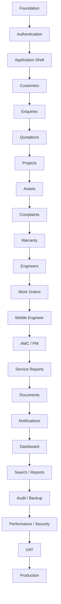

# Airmech One — Development Task Plan

**Product:** Airmech One  
**Built by:** Qeilvra

This file defines the implementation order, task status, dependencies, and acceptance checks for the complete project.

Latest targeted acceptance closeout: 7 October 2026; see [the acceptance report](docs/verification/acceptance-closeout.md). Earlier full audit: reconciled 6 October 2026 against source, current automated/live checks, historical evidence and approved decisions. All 133 formal tasks have explicit states; there is no TASK-009. See [the complete audit and per-task gaps](docs/verification/full-reconciliation.md). A BACKLOG state identifies unstarted work; it does not claim a configurable production value prevents all implementation.

---

# 1. Core Rule

**Do not compromise software speed at any stage.**

Every completed task must be checked for:

- performance
- security
- permissions
- desktop behavior
- mobile behavior
- error handling
- loading states
- data safety

A feature is not complete if it works but makes the system noticeably slower.

---

# 2. Task States

Use only:

```text
BACKLOG
READY
IN_PROGRESS
BLOCKED
REVIEW
DONE
```

Example:

```text
[TASK-031] Complaint Assignment
Status: IN_PROGRESS
```

---

# 3. Before Starting Any Task

Before coding:

```text
Read project docs
      ↓
Understand requirement
      ↓
Inspect existing code
      ↓
Find owning module
      ↓
Check database impact
      ↓
Check permissions
      ↓
Check desktop + mobile UX
      ↓
Check performance risk
      ↓
Implement
      ↓
Test
```

Read:

1. `MEMORY.md`
2. `PRD.md`
3. `RULES.md`
4. `DESIGN.md`
5. `ARCHITECTURE.md`
6. `PERFORMANCE.md`
7. `SECURITY.md`
8. `FEATURES.md`
9. `WORKFLOWS.md`
10. `TASK.md`
11. `ROADMAP.md`

---

# 4. Definition of Ready

A task becomes `READY` when:

- requirement is understood
- module owner is identified
- dependencies are complete
- permissions are understood
- database impact is understood
- desktop behavior is defined
- mobile behavior is defined
- acceptance criteria exist
- no major unanswered business question remains

---

# 5. Definition of Done

A task is `DONE` only when:

- functionality works
- desktop works
- mobile works
- mobile is not just vertically stacked desktop
- permissions work
- validation works
- loading state exists
- empty state exists
- error state exists
- tests pass
- TypeScript passes
- lint passes
- database migration is safe
- audit is added where required
- performance is acceptable
- security is reviewed
- no unnecessary requests are added
- `TASK.md` status is updated

---

# 6. Phase 0 — Project Foundation

## TASK-001 — Create Monorepo

Status: DONE

Reconciled 6 October 2026: Workspace resolution, 11 app/package builds and compiled startup verified; no foundation acceptance gap.
Evidence and remaining acceptance: [task-001 verification](docs/verification/task-001.md).

Create:

```text
apps/
├── web/
├── api/
└── worker/

packages/
├── ui/
├── contracts/
├── database/
├── config/
└── testing/
```

Acceptance:

- project installs
- all apps build
- shared packages resolve correctly

---

## TASK-002 — TypeScript Configuration

Status: DONE

Reconciled 6 October 2026: Strict presets and complete workspace/tooling typechecking verified; no foundation acceptance gap.
Evidence and remaining acceptance: [task-002 verification](docs/verification/task-002.md).

Requirements:

- strict mode
- shared config
- no unnecessary `any`
- path aliases

---

## TASK-003 — Code Quality

Status: DONE

Reconciled 6 October 2026: Established build/lint/format/type/test/browser/advisory gates verified after three narrow formatting fixes.
Evidence and remaining acceptance: [task-003 verification](docs/verification/task-003.md).

Configure:

- ESLint
- formatting
- type checking
- unit testing
- integration testing

---

## TASK-004 — Environment Configuration

Status: DONE

Reconciled 6 October 2026: Typed environment validation, public allowlist, ignored local configuration and startup/boundary tests verified. The former IN_PROGRESS label was stale.
Evidence and remaining acceptance: [task-004 verification](docs/verification/task-004.md).

Create validated environment handling for:

```text
DATABASE_URL
REDIS_URL
AUTH_SECRET
OBJECT_STORAGE
EMAIL
OBSERVABILITY
```

Never expose secrets to frontend code.

---

## TASK-005 — PostgreSQL

Status: DONE

Reconciled 6 October 2026: Read-only live Supabase verified strict CA/TLS, safe queries, pool reuse and migration-0001 checksum. All five migrations/replay/rollback verified locally. Cloud deployment of 0002–0005 is separate.
Evidence and remaining acceptance: [task-005 verification](docs/verification/task-005.md).

Set up:

- database
- migrations
- connection pooling
- development seed strategy

---

## TASK-006 — Redis / Job Queue

Status: DONE

Reconciled 6 October 2026: Real isolated Redis producer/consumer, compiled worker, retries, deduplication, retained failures and cleanup passed.
Evidence and remaining acceptance: [task-006 verification](docs/verification/task-006.md).

Required for:

- emails
- PDFs
- exports
- AMC jobs
- later WhatsApp
- later AI

---

## TASK-007 — Object Storage

Status: DONE

Reconciled 6 October 2026: Current private-bucket read-only check and storage unit/stream/authorization tests passed. Historical live upload, public/anonymous denial, signing, expiry and cleanup evidence retained; no cloud object mutation repeated.
Evidence and remaining acceptance: [task-007 verification](docs/verification/task-007.md).

Support private files:

- documents
- photos
- service reports
- quotation PDFs

---

## TASK-008 — CI Pipeline

Status: DONE

Reconciled 6 October 2026: Workflow structure and deterministic frozen install/quality/disposable-service steps verified. Prior hosted passing runs retained; latest hosted result is recorded separately, without claiming unpushed changes passed remotely.
Evidence and remaining acceptance: [task-008 verification](docs/verification/task-008.md).

Run on every PR:

```text
install
typecheck
lint
tests
build
```

There is no TASK-009. Current implementation is recorded in the reconciliation report.

---

# 7. Phase 1 — Authentication & Users

## TASK-010 — User Model

Status: DONE

Reconciled 6 October 2026: User identity linkage, active/invited/disabled state, constraints, indexed repository and live SQL integrity passed; no password duplication.
Evidence and remaining acceptance: [task-010 verification](docs/verification/task-010.md).

Create:

- user
- status
- employee details
- role relation
- last login

---

## TASK-011 — Roles

Status: DONE

Acceptance closeout 7 October 2026: Active roles are enforced in current server principals. Super Admin-only lifecycle/grant changes are locked, audited and revoke sessions; final effective administrator protection and concurrency/security checks pass.
Evidence and remaining acceptance: [task-011 verification](docs/verification/task-011.md).

Create:

```text
Super Admin
Management
Sales/Admin
Service Manager
Engineer
Project Manager
Accounts
Store
```

---

## TASK-012 — Permissions

Status: DONE

Reconciled 6 October 2026: Normalized permission catalog/mappings and persisted SQL grants match all eight approved role baselines. Current resolution, deny defaults and removal tests passed. Customer field/managed-project enforcement remains in TASK-031–035.
Evidence and remaining acceptance: [task-012 verification](docs/verification/task-012.md).

Examples:

```text
customer.read
customer.write

quotation.create
quotation.approve

complaint.create
complaint.assign
complaint.resolve
complaint.close

workorder.read
workorder.update_own

report.export
admin.users
```

---

## TASK-013 — Login

Status: DONE

Reconciled 6 October 2026: Real approved temporary Supabase user authenticated through the API; mapped engineer profile/session/protected access/logout/denial passed; deletion confirmed. Fixture API expiry, forged payload, CSRF, rate limits and browser login passed.
Evidence and remaining acceptance: [task-013 verification](docs/verification/task-013.md).

Implement:

- login
- logout
- sessions
- invalid credentials
- disabled account handling

---

## TASK-014 — Password Reset

Status: REVIEW

Acceptance closeout 7 October 2026: Complete PKCE UI/API/worker recovery, invitation recovery, expiry/invalid/replay/provider-failure denial and concurrent-disable protection pass. Actual delivered-link reset remains unverified; Supabase HTTP 429 blocks delivery to the current authorized inbox.
Evidence and remaining acceptance: [task-014 verification](docs/verification/task-014.md).

Include:

- secure reset token
- expiry
- invalid-token state

---

## TASK-015 — User Administration

Status: REVIEW

Acceptance closeout 7 October 2026: Invitation/resend/confirmed-identity recovery, correct enable/disable/setup transitions, provisioning rollback, security audit and accurate bounded pagination pass. Actual invite/setup/resend remains unverified; Supabase HTTP 429 blocks delivery to the current authorized inbox.
Evidence and remaining acceptance: [task-015 verification](docs/verification/task-015.md).

Admin can:

- create user
- edit user
- disable user
- assign roles

---

## TASK-016 — Authorization Guards

Status: DONE

Reconciled 6 October 2026: Global server guard, current active-user/session/permission checks, explicit security-role scope and trusted object-policy foundation verified. Future customer/project/job repository relationships are not claimed implemented.
Evidence and remaining acceptance: [task-016 verification](docs/verification/task-016.md).

Backend must enforce all protected actions.

Frontend permission checks are for UX only.

---

## TASK-017 — Authentication Audit

Status: DONE

Reconciled 6 October 2026: Actual transactional login/logout/reset/user-status/role/grant audit producers verified in disposable PostgreSQL; append-only trigger rejects mutation and details exclude secrets. Role changes use semantic before/after events.
Evidence and remaining acceptance: [task-017 verification](docs/verification/task-017.md).

Track:

```text
LOGIN_SUCCESS
LOGIN_FAILED
PASSWORD_RESET
USER_DISABLED
ROLE_CHANGED
```

---

# 8. Phase 2 — Application Shell

## TASK-020 — Desktop Layout

Status: DONE

Acceptance closeout 7 October 2026: Account menu/profile/recovery/sign-out, permission-aware page search, lazy recipient-scoped notification drawer and desktop/mobile navigation pass all four viewport checks. Business-wide record search remains a later task.
Evidence and remaining acceptance: [task-020 verification](docs/verification/task-020.md).

Build:

```text
Sidebar
Top Bar
Global Search
Notifications
User Menu
Page Workspace
```

Follow `DESIGN.md`.

---

## TASK-021 — Mobile Navigation

Status: DONE

Reconciled 6 October 2026: Permission-aware dedicated bottom navigation, touch controls and access to implemented pages verified across four viewport projects; future engineer job screens remain TASK-120–125.
Evidence and remaining acceptance: [task-021 verification](docs/verification/task-021.md).

Build mobile-specific navigation.

Recommended:

```text
Home
Work
Customers
Search
More
```

Do NOT simply collapse desktop sidebar.

---

## TASK-022 — Responsive Layout System

Status: DONE

Reconciled 6 October 2026: Implemented auth/workspace/admin/shared controls verified at mobile/tablet/desktop/wide sizes without horizontal overflow; mobile cards/bottom navigation preserve implemented permitted capabilities.
Evidence and remaining acceptance: [task-022 verification](docs/verification/task-022.md).

Support:

```text
Mobile
Tablet
Desktop
Wide Desktop
```

Mobile must use:

- tabs
- sheets
- drawers
- drill-down views
- sticky actions

---

## TASK-023 — Shared UI Components

Status: DONE

Reconciled 6 October 2026: All 18 documented shared controls/state/navigation/table components verified for reuse, focus, validation and bounded mobile cards; no component acceptance gap.
Evidence and remaining acceptance: [task-023 verification](docs/verification/task-023.md).

Create:

```text
Button
Input
Select
Textarea
Checkbox
DatePicker
Modal
Drawer
Sheet
Tabs
StatusBadge
DataTable
Pagination
SearchField
EmptyState
ErrorState
Skeleton
PageHeader
```

Avoid duplicate components.

---

# 9. Phase 3 — Customers & Sites

## TASK-030 — Customer Model

Status: DONE

Reconciled 6 October 2026: Customer fields, supplied-code uniqueness, contact ownership, archival integrity and RLS passed real SQL tests. CRUD/sites are separate incomplete tasks.
Evidence and remaining acceptance: [task-030 verification](docs/verification/task-030.md).

Fields:

- company name
- customer code
- primary contact
- phone
- email
- status

---

## TASK-031 — Customer CRUD

Status: READY

Reconciled 6 October 2026: Implement authenticated create/read/update/archive APIs, validation/audit and desktop/mobile flows. Enforce confirmed Service Manager field allowlist and archive prohibition, and managed-project-only Project Manager access/no creation. Preserve supplied codes; confirm any generated numbering before adding it.
Evidence and remaining acceptance: [task-031 verification](docs/verification/task-031.md).

Implement:

- create
- read
- update
- archive

Avoid destructive permanent deletion by default.

---

## TASK-032 — Customer Contacts

Status: BACKLOG

Reconciled 6 October 2026: Contact ownership schema exists. Add multiple-contact CRUD, field validation/audit, approved operational-field enforcement and browser flows after customer CRUD.
Evidence and remaining acceptance: [task-032 verification](docs/verification/task-032.md).

Multiple contacts per customer.

---

## TASK-033 — Customer Sites

Status: BACKLOG

Reconciled 6 October 2026: No site schema/API/UI. Add documented site fields/ownership and service-field/managed-project authorization with migrations and tests.
Evidence and remaining acceptance: [task-033 verification](docs/verification/task-033.md).

Each customer can have multiple sites.

Fields:

- site name
- address
- contact
- location
- notes

---

## TASK-034 — Customer List

Status: BACKLOG

Reconciled 6 October 2026: No actual customer list API/screen. Add permission-filtered server pagination/search/filter/sort, desktop table/mobile cards and live-data browser acceptance.
Evidence and remaining acceptance: [task-034 verification](docs/verification/task-034.md).

Desktop:

- table
- filters
- search
- pagination

Mobile:

- compact customer cards/list
- drill-down details

Never load all customers at once.

---

## TASK-035 — Customer 360

Status: BACKLOG

Reconciled 6 October 2026: No Customer 360 route/APIs. Add lazy overview/contact/site/asset/enquiry/quotation/project/complaint/AMC/document/activity relations and authorized integration.
Evidence and remaining acceptance: [task-035 verification](docs/verification/task-035.md).

Show:

```text
Overview
Contacts
Sites
Assets
Enquiries
Quotations
Projects
Complaints
AMC
Documents
Activity
```

Load tabs only when needed.

---

# 10. Phase 4 — Enquiries

## TASK-040 — Enquiry Model

Status: BACKLOG

Reconciled 6 October 2026: No enquiry schema/contracts/repository. Model documented customer/site/source/requirement/owner/priority/status/next action/follow-up/notes with constraints and tests.
Evidence and remaining acceptance: [task-040 verification](docs/verification/task-040.md).

Fields:

```text
ID
Customer
Site
Source
Requirement
Owner
Priority
Status
Next Action
Follow-up Date
Notes
```

---

## TASK-041 — Enquiry Creation

Status: BACKLOG

Reconciled 6 October 2026: No enquiry creation API/UI. Implement validated documented intake sources and authorized customer/site selection, ownership and audit.
Evidence and remaining acceptance: [task-041 verification](docs/verification/task-041.md).

Sources:

```text
Phone
Email
Website
WhatsApp
Referral
Existing Customer
Direct RFQ
```

---

## TASK-042 — Enquiry Pipeline

Status: BACKLOG

Reconciled 6 October 2026: No enquiry pipeline. Implement documented NEW through WON/LOST transitions, paginated views and validation.
Evidence and remaining acceptance: [task-042 verification](docs/verification/task-042.md).

Statuses:

```text
NEW
QUALIFIED
SITE_VISIT
RFQ
QUOTATION
NEGOTIATION
WON
LOST
```

---

## TASK-043 — Enquiry Assignment

Status: BACKLOG

Reconciled 6 October 2026: No enquiry assignment/reassignment service/UI. Add trusted authorized ownership transitions and audit.
Evidence and remaining acceptance: [task-043 verification](docs/verification/task-043.md).

Allow assignment/reassignment.

Create audit event.

---

## TASK-044 — Follow-up Automation

Status: BACKLOG

Reconciled 6 October 2026: No follow-up scheduler/jobs. Implement no-next-action/overdue reminders and manager escalation with configurable timing, durable deduplication and tests.
Evidence and remaining acceptance: [task-044 verification](docs/verification/task-044.md).

Rules:

```text
No next action
→ Reminder

Follow-up overdue
→ Employee reminder

Still overdue
→ Manager escalation
```

---

# 11. Phase 5 — Quotations

## TASK-050 — Quotation Model

Status: BACKLOG

Reconciled 6 October 2026: No quotation schema. Implement configurable money/currency/tax/rounding, numbered revisions and immutable line-item records; confirm actual monetary/numbering values before commercial acceptance.
Evidence and remaining acceptance: [task-050 verification](docs/verification/task-050.md).

Include:

- customer
- enquiry
- revision
- line items
- price
- discount
- tax
- warranty
- terms
- validity
- status

---

## TASK-051 — Quotation Builder

Status: BACKLOG

Reconciled 6 October 2026: No quotation builder. Implement multiple product/service lines, validated totals and role-aware desktop/mobile forms.
Evidence and remaining acceptance: [task-051 verification](docs/verification/task-051.md).

Support multiple products/services.

---

## TASK-052 — Quotation Revision History

Status: BACKLOG

Reconciled 6 October 2026: No revision history. Implement immutable version snapshots and numbering with SQL/API/UI tests.
Evidence and remaining acceptance: [task-052 verification](docs/verification/task-052.md).

Never overwrite previous revisions.

Example:

```text
QT-2026-0041
Revision 1
Revision 2
Revision 3
```

---

## TASK-053 — Approval Workflow

Status: BLOCKED

Reconciled 6 October 2026: Approval hierarchy, tiers, thresholds, discount limits and approvers are unconfirmed. Configurable scaffolding can proceed; final actual approval-policy acceptance is blocked.
Evidence and remaining acceptance: [task-053 verification](docs/verification/task-053.md).

Statuses:

```text
DRAFT
INTERNAL_APPROVAL
APPROVED
SENT
FOLLOW_UP
NEGOTIATION
ACCEPTED
REJECTED
EXPIRED
```

---

## TASK-054 — Quotation PDF

Status: BACKLOG

Reconciled 6 October 2026: No quotation PDF job/template/storage flow. Implement asynchronous generation, safe authorized download, retries and failure UX.
Evidence and remaining acceptance: [task-054 verification](docs/verification/task-054.md).

Generate asynchronously.

Flow:

```text
Save Quotation
      ↓
Queue PDF Job
      ↓
Return User Success
      ↓
Worker Generates PDF
```

---

## TASK-055 — Quotation Follow-up

Status: BACKLOG

Reconciled 6 October 2026: No quotation reminders. Implement configurable sent/next-action/expiry follow-up jobs and recipients with deduplication.
Evidence and remaining acceptance: [task-055 verification](docs/verification/task-055.md).

Create reminders based on:

- sent date
- next action
- expiry

---

## TASK-056 — Quotation → Project

Status: BACKLOG

Reconciled 6 October 2026: No accepted-quotation conversion. Add authorized transactional project creation and duplicate/concurrent-conversion protection.
Evidence and remaining acceptance: [task-056 verification](docs/verification/task-056.md).

Accepted quotation can create a project/order.

Must use transaction.

---

# 12. Phase 6 — Projects

## TASK-060 — Project Model

Status: BACKLOG

Reconciled 6 October 2026: No project schema/service. Model customer/site/manager/team/contract/dates/status and trusted managed-project relationships.
Evidence and remaining acceptance: [task-060 verification](docs/verification/task-060.md).

Include:

- customer
- site
- project manager
- team
- contract reference
- start/end
- status

---

## TASK-061 — Project Lifecycle

Status: BACKLOG

Reconciled 6 October 2026: No project lifecycle. Implement PLANNING through WARRANTY transitions and audit.
Evidence and remaining acceptance: [task-061 verification](docs/verification/task-061.md).

```text
PLANNING
ENGINEERING
PROCUREMENT
INSTALLATION
TESTING
COMMISSIONING
HANDOVER
WARRANTY
```

---

## TASK-062 — Milestones

Status: BACKLOG

Reconciled 6 October 2026: No milestones. Implement due dates, owner, status/progress and linked permissions.
Evidence and remaining acceptance: [task-062 verification](docs/verification/task-062.md).

Support:

- due date
- owner
- status
- progress

---

## TASK-063 — Tasks

Status: BACKLOG

Reconciled 6 October 2026: No project/milestone task functionality. Add model, CRUD, ownership, state transitions and UI.
Evidence and remaining acceptance: [task-063 verification](docs/verification/task-063.md).

Tasks belong to project/milestone.

---

## TASK-064 — Project Issues

Status: BACKLOG

Reconciled 6 October 2026: No project issues. Implement severity/owner/due/resolution workflow, validation and audit.
Evidence and remaining acceptance: [task-064 verification](docs/verification/task-064.md).

Track:

- issue
- severity
- owner
- due date
- resolution

---

## TASK-065 — Project Documents

Status: BACKLOG

Reconciled 6 October 2026: No project document associations/UI. Add authorized drawing/BOQ/contract/commissioning/handover links through private storage.
Evidence and remaining acceptance: [task-065 verification](docs/verification/task-065.md).

Support:

- drawings
- BOQ
- contracts
- site documents
- commissioning
- handover

---

# 13. Phase 7 — Asset / Equipment Registry

## TASK-070 — Asset Model

Status: BACKLOG

Reconciled 6 October 2026: No asset schema. Implement documented identity/customer/site/category/brand/model/serial/install/warranty/AMC/status fields.
Evidence and remaining acceptance: [task-070 verification](docs/verification/task-070.md).

Fields:

```text
Asset ID
Customer
Site
Category
Brand
Model
Serial
Installation Date
Warranty Start
Warranty End
AMC
Status
```

---

## TASK-071 — Asset Creation

Status: BACKLOG

Reconciled 6 October 2026: No asset creation/import/project registration. Add ownership, validation/audit and idempotent origins.
Evidence and remaining acceptance: [task-071 verification](docs/verification/task-071.md).

Assets can originate from:

- project
- manual entry
- import

---

## TASK-072 — Asset Search

Status: BACKLOG

Reconciled 6 October 2026: No asset search. Add permission-filtered indexed ID/serial/customer/site/model search with bounded pages.
Evidence and remaining acceptance: [task-072 verification](docs/verification/task-072.md).

Search strongly by:

```text
Asset ID
Serial Number
Customer
Site
Model
```

Must be indexed.

---

## TASK-073 — Asset History

Status: BACKLOG

Reconciled 6 October 2026: No asset history APIs/UI. Integrate installation/warranty/complaint/work/maintenance/report/document history with lazy pagination.
Evidence and remaining acceptance: [task-073 verification](docs/verification/task-073.md).

Show:

```text
Installation
Warranty
Complaints
Work Orders
Maintenance
Service Reports
Documents
```

Do not load full multi-year history automatically.

---

# 14. Phase 8 — Complaints

## TASK-080 — Complaint Model

Status: BACKLOG

Reconciled 6 October 2026: No complaint schema. Model documented customer/site/asset/description/category/priority/status/SLA/reporter/assignment/timestamps.
Evidence and remaining acceptance: [task-080 verification](docs/verification/task-080.md).

Fields:

```text
Complaint ID
Customer
Site
Asset
Description
Category
Priority
Status
SLA
Reported By
Assigned Engineer
Created At
Resolved At
Closed At
```

---

## TASK-081 — Complaint Creation

Status: BACKLOG

Reconciled 6 October 2026: No complaint creation/upload flow. Add intake validation, private authorized attachments and audit; confirm launch intake channels when configuring them.
Evidence and remaining acceptance: [task-081 verification](docs/verification/task-081.md).

Allow attachment of:

- images
- videos
- documents

---

## TASK-082 — Complaint Status Workflow

Status: BACKLOG

Reconciled 6 October 2026: No complaint state machine. Implement documented RECEIVED through CLOSED transitions with required data and audit.
Evidence and remaining acceptance: [task-082 verification](docs/verification/task-082.md).

```text
RECEIVED
WARRANTY_CHECK
TRIAGE
ASSIGNED
SCHEDULED
ON_SITE
IN_PROGRESS
WAITING_PART
ESCALATED
RESOLVED
CUSTOMER_CONFIRMED
CLOSED
```

---

## TASK-083 — Complaint SLA

Status: BACKLOG

Reconciled 6 October 2026: No configurable SLA engine/jobs. Build priority/due/warning/breach/escalation/calendar structures; final production hours/calendars/escalation values remain unconfirmed.
Evidence and remaining acceptance: [task-083 verification](docs/verification/task-083.md).

Support:

- SLA due time
- warning
- breach
- escalation

---

## TASK-084 — Complaint Detail

Status: BACKLOG

Reconciled 6 October 2026: No complaint detail. Add overview/timeline/work order/asset/documents with desktop split view and mobile tabs/drill-down.
Evidence and remaining acceptance: [task-084 verification](docs/verification/task-084.md).

Desktop:

```text
Overview
Timeline
Work Orders
Asset
Documents
```

Mobile:

same capabilities using tabs/drill-down.

---

## TASK-085 — Complaint Reopen

Status: BACKLOG

Reconciled 6 October 2026: No reopen endpoint/UI. Add authorized reason-based transition and audit.
Evidence and remaining acceptance: [task-085 verification](docs/verification/task-085.md).

Authorized users can reopen with reason.

Audit required.

---

# 15. Phase 9 — Warranty

## TASK-090 — Warranty Check

Status: BACKLOG

Reconciled 6 October 2026: No asset warranty evaluation. Implement configured asset-date checks; product-specific coverage remains unconfirmed for final eligibility acceptance.
Evidence and remaining acceptance: [task-090 verification](docs/verification/task-090.md).

Determine using asset warranty dates.

---

## TASK-091 — Warranty Workflow

Status: BACKLOG

Reconciled 6 October 2026: Warranty → AMC → paid-service routing is confirmed, so the old missing-flow blocker is removed. Implement actual asset/contract-linked routing and verify configurable coverage.
Evidence and remaining acceptance: [task-091 verification](docs/verification/task-091.md).

```text
Complaint
↓
Warranty Active?
├─ Yes → Warranty Service
└─ No
    ↓
    AMC Active?
    ├─ Yes → AMC Service
    └─ No → Paid Service
```

---

## TASK-092 — Warranty Override

Status: BACKLOG

Reconciled 6 October 2026: Override authority is represented by approved grants and reason/user/time/audit are confirmed. Implement actual guarded override and ownership checks; no blanket matrix blocker remains.
Evidence and remaining acceptance: [task-092 verification](docs/verification/task-092.md).

Authorized users only.

Require:

- reason
- user
- timestamp

Audit event required.

---

# 16. Phase 10 — Engineers

## TASK-100 — Engineer Profile

Status: BACKLOG

Reconciled 6 October 2026: User profiles exist; no engineer-specific skills/availability model or UI. Implement engineer profile ownership and validation.
Evidence and remaining acceptance: [task-100 verification](docs/verification/task-100.md).

Store:

- employee
- skills
- availability
- working status

---

## TASK-101 — Engineer Schedule

Status: BACKLOG

Reconciled 6 October 2026: No engineer schedule. Implement protected schedule storage/views and assigned-job integration.
Evidence and remaining acceptance: [task-101 verification](docs/verification/task-101.md).

Show:

- jobs
- PM visits
- workload

---

## TASK-102 — Engineer Availability

Status: BACKLOG

Reconciled 6 October 2026: No engineer availability service/UI. Implement trusted availability and workload calculation.
Evidence and remaining acceptance: [task-102 verification](docs/verification/task-102.md).

Statuses:

```text
AVAILABLE
ASSIGNED
TRAVELLING
ON_SITE
WORKING
WAITING_PART
OFF_DUTY
```

---

## TASK-103 — Assignment Conflict Check

Status: BACKLOG

Reconciled 6 October 2026: No assignment conflict checks. Implement transactional overlap/capacity checks and concurrent tests.
Evidence and remaining acceptance: [task-103 verification](docs/verification/task-103.md).

Warn when:

- overlapping jobs
- engineer unavailable

---

# 17. Phase 11 — Work Orders

## TASK-110 — Work Order Model

Status: BACKLOG

Reconciled 6 October 2026: No work-order schema. Model links/assignment/schedule/instructions/field execution with constraints.
Evidence and remaining acceptance: [task-110 verification](docs/verification/task-110.md).

Link to:

- customer
- site
- asset
- complaint
- engineer
- AMC/maintenance if relevant

---

## TASK-111 — Work Order Status

Status: BACKLOG

Reconciled 6 October 2026: No work-order state machine. Implement documented engineer execution transitions and required completion data.
Evidence and remaining acceptance: [task-111 verification](docs/verification/task-111.md).

```text
ASSIGNED
SCHEDULED
TRAVELLING
ON_SITE
IN_PROGRESS
WAITING_PART
ESCALATED
RESOLVED
CUSTOMER_CONFIRMED
CLOSED
```

---

## TASK-112 — Work Order Assignment

Status: BACKLOG

Reconciled 6 October 2026: No work-order assignment. Add permissions, trusted engineer availability, conflict protection and audit.
Evidence and remaining acceptance: [task-112 verification](docs/verification/task-112.md).

Must check:

- permissions
- current work-order state
- engineer availability
- schedule conflicts

---

## TASK-113 — Engineer Field Data

Status: BACKLOG

Reconciled 6 October 2026: No engineer field-data flows. Implement owned diagnosis/work/readings/parts/photos/recommendations with validation and mobile UX.
Evidence and remaining acceptance: [task-113 verification](docs/verification/task-113.md).

Capture:

- diagnosis
- work performed
- readings
- photos
- parts
- recommendations
- notes

---

## TASK-114 — Customer Signature

Status: BACKLOG

Reconciled 6 October 2026: No customer signature capture/storage. Define consent/format, link signatures to completed work and verify authorized retrieval.
Evidence and remaining acceptance: [task-114 verification](docs/verification/task-114.md).

Store securely with work order/service report.

---

# 18. Phase 12 — Engineer Mobile Experience

## TASK-120 — Mobile Home

Status: BACKLOG

Reconciled 6 October 2026: No engineer task home. Account workspace is not today/upcoming jobs; implement real assigned-job summaries.
Evidence and remaining acceptance: [task-120 verification](docs/verification/task-120.md).

Show:

```text
Today's Jobs
Next Job
High Priority
PM Visits
Notifications
```

---

## TASK-121 — Mobile Jobs

Status: BACKLOG

Reconciled 6 October 2026: No mobile jobs screen/APIs. Add paginated assigned today/upcoming jobs with same server permissions.
Evidence and remaining acceptance: [task-121 verification](docs/verification/task-121.md).

Use task-oriented list.

Do not display desktop table.

---

## TASK-122 — Mobile Job Detail

Status: BACKLOG

Reconciled 6 October 2026: No mobile job detail. Implement task-focused customer/site/asset/history/instructions/diagnosis/readings/photos/parts/signature views.
Evidence and remaining acceptance: [task-122 verification](docs/verification/task-122.md).

Tabs:

```text
Overview
Asset
History
Work
Documents
```

---

## TASK-123 — Sticky Job Actions

Status: BACKLOG

Reconciled 6 October 2026: No sticky execution actions. Add contextual start/update/resolve/complete actions backed by validated state transitions.
Evidence and remaining acceptance: [task-123 verification](docs/verification/task-123.md).

Examples:

```text
Start Job
Arrived
Update
Resolve
Complete
More
```

---

## TASK-124 — Mobile Photo Upload

Status: BACKLOG

Reconciled 6 October 2026: No engineer photo upload UI. Add compression/progress/retry/private job associations and bounded upload verification.
Evidence and remaining acceptance: [task-124 verification](docs/verification/task-124.md).

Requirements:

- compression
- progress
- retry
- do not lose job notes

---

## TASK-125 — Weak Network Handling

Status: BACKLOG

Reconciled 6 October 2026: No weak-network field-form recovery. Preserve notes, retry safely and test interrupted mobile uploads/updates.
Evidence and remaining acceptance: [task-125 verification](docs/verification/task-125.md).

Preserve unsaved field data where practical.

Provide:

- retry
- upload failure state
- connection indication

---

# 19. Phase 13 — AMC

## TASK-130 — AMC Contract Model

Status: BACKLOG

Reconciled 6 October 2026: No AMC schema. Model customer/sites/assets/contract dates/configurable frequency/status/renewal context.
Evidence and remaining acceptance: [task-130 verification](docs/verification/task-130.md).

Fields:

- customer
- contract dates
- covered sites
- covered assets
- frequency
- status
- renewal date

---

## TASK-131 — AMC Schedule Generation

Status: BACKLOG

Reconciled 6 October 2026: No schedule generator. Build per-contract configurable frequency/date/timezone scheduling and durable idempotency; actual contract frequencies remain unconfirmed.
Evidence and remaining acceptance: [task-131 verification](docs/verification/task-131.md).

Generate future PM schedule.

Must prevent duplicates.

---

## TASK-132 — PM Calendar

Status: BACKLOG

Reconciled 6 October 2026: No PM calendar. Implement authorized due/completed/overdue maintenance views.
Evidence and remaining acceptance: [task-132 verification](docs/verification/task-132.md).

Desktop:

- calendar/list

Mobile:

- date-focused list
- upcoming jobs

---

## TASK-133 — AMC Notifications

Status: BACKLOG

Reconciled 6 October 2026: No AMC notifications. Add configurable due/expiry recipients/jobs and delivery acceptance.
Evidence and remaining acceptance: [task-133 verification](docs/verification/task-133.md).

Examples:

```text
60 days before expiry
30 days before expiry
15 days before expiry
```

Exact business rules should be configurable.

---

## TASK-134 — AMC Renewal

Status: BACKLOG

Reconciled 6 October 2026: No AMC renewal. Implement expiry/renewal records and alerts; final renewal rules require confirmation without blocking all AMC scaffolding.
Evidence and remaining acceptance: [task-134 verification](docs/verification/task-134.md).

Create renewal action/opportunity.

---

# 20. Phase 14 — Preventive Maintenance

## TASK-140 — PM Work Orders

Status: BACKLOG

Reconciled 6 October 2026: No automatic PM work orders. Integrate AMC schedule → work order with transactional/durable duplicate protection.
Evidence and remaining acceptance: [task-140 verification](docs/verification/task-140.md).

Automatically create required jobs.

---

## TASK-141 — PM Engineer Assignment

Status: BACKLOG

Reconciled 6 October 2026: No PM engineer assignment. Integrate availability/conflicts, ownership and audit.
Evidence and remaining acceptance: [task-141 verification](docs/verification/task-141.md).

Same scheduling rules as normal work order.

---

## TASK-142 — PM Completion

Status: BACKLOG

Reconciled 6 October 2026: No PM completion. Require field data/customer confirmation, report and next-visit/history integration.
Evidence and remaining acceptance: [task-142 verification](docs/verification/task-142.md).

Update:

- work order
- asset history
- AMC visit
- next maintenance

---

# 21. Phase 15 — Service Reports

## TASK-150 — Service Report Data

Status: BACKLOG

Reconciled 6 October 2026: No service report model/data aggregation. Implement documented work/customer/site/asset/engineer/times/diagnosis/readings/photos/parts/signatures.
Evidence and remaining acceptance: [task-150 verification](docs/verification/task-150.md).

Include:

```text
Customer
Site
Asset
Complaint
Work Order
Engineer
Arrival Time
Completion Time
Diagnosis
Work Performed
Parts
Readings
Photos
Recommendations
Customer Signature
Engineer Signature
```

---

## TASK-151 — Service Report PDF

Status: BACKLOG

Reconciled 6 October 2026: No service-report PDF processor/template. Build async structure; final client report/signature format remains unconfirmed for template acceptance.
Evidence and remaining acceptance: [task-151 verification](docs/verification/task-151.md).

Generate via worker.

Do not block user request.

---

## TASK-152 — Report Storage

Status: BACKLOG

Reconciled 6 October 2026: No service-report document links. Add private report records and authorized customer/asset/complaint/work-order associations.
Evidence and remaining acceptance: [task-152 verification](docs/verification/task-152.md).

Link report to:

- customer
- asset
- complaint
- work order

---

# 22. Phase 16 — Documents

## TASK-160 — Document Upload

Status: BACKLOG

Reconciled 6 October 2026: Storage adapter exists; no document module/upload API/UI. Implement supported business formats, validation, progress/retry and audit.
Evidence and remaining acceptance: [task-160 verification](docs/verification/task-160.md).

Support:

- RFQ
- quotation
- PO
- contracts
- drawings
- BOQ
- manuals
- warranty
- service reports
- images

---

## TASK-161 — Document Security

Status: BACKLOG

Reconciled 6 October 2026: Private storage primitives exist; no authenticated document association resolver/routes. Wire trusted actor/entity/owner policies and verify actual access.
Evidence and remaining acceptance: [task-161 verification](docs/verification/task-161.md).

Require:

- permission
- file validation
- private storage
- secure downloads

---

## TASK-162 — Document Linking

Status: BACKLOG

Reconciled 6 October 2026: No document association model/API. Add ownership-linked customer/project/asset/complaint/work-order/AMC/quotation relations.
Evidence and remaining acceptance: [task-162 verification](docs/verification/task-162.md).

Documents may belong to:

```text
Customer
Project
Asset
Complaint
Work Order
AMC
Quotation
```

---

# 23. Phase 17 — Notifications

## TASK-170 — Notification Model

Status: DONE

Reconciled 6 October 2026: Recipient/channel/read-state/deduplication schema passed real SQL integrity/RLS tests; it does not complete notification delivery.
Evidence and remaining acceptance: [task-170 verification](docs/verification/task-170.md).

Support:

```text
In App
Email
```

Phase 2:

```text
WhatsApp
SMS
```

---

## TASK-171 — Notification Center

Status: BACKLOG

Reconciled 6 October 2026: No recipient-scoped notification API/center. Implement unread/read/linked entity/action, pagination and permission checks against real events.
Evidence and remaining acceptance: [task-171 verification](docs/verification/task-171.md).

Features:

- unread
- read
- linked entity
- action

---

## TASK-172 — Notification Worker

Status: BACKLOG

Reconciled 6 October 2026: Auth-only delivery worker exists; general notification records/events are not consumed. Implement recipient/event selection, durable outbox recovery, idempotency and verified business email delivery.
Evidence and remaining acceptance: [task-172 verification](docs/verification/task-172.md).

Do not send notifications synchronously from business requests.

---

# 24. Phase 18 — Dashboard

## TASK-180 — KPI Summary

Status: BACKLOG

Reconciled 6 October 2026: No KPI APIs/dashboard widgets. Implement actual permission-filtered enquiry/quotation/project/complaint/engineer/AMC/warranty summaries.
Evidence and remaining acceptance: [task-180 verification](docs/verification/task-180.md).

Examples:

```text
Open Enquiries
Pending Quotations
Active Projects
Open Complaints
Engineer Jobs
AMC Due
Warranty Cases
```

---

## TASK-181 — Work Needing Attention

Status: BACKLOG

Reconciled 6 October 2026: No attention feed. Implement real overdue follow-up/SLA/project/work/AMC exceptions with bounded authorized queries.
Evidence and remaining acceptance: [task-181 verification](docs/verification/task-181.md).

Show exceptions:

- overdue follow-ups
- SLA risk
- delayed projects
- overdue work orders
- AMC expiry

---

## TASK-182 — Engineer Overview

Status: BACKLOG

Reconciled 6 October 2026: No engineer overview. Implement available/working/scheduled/overloaded summaries from actual schedules/jobs.
Evidence and remaining acceptance: [task-182 verification](docs/verification/task-182.md).

Show:

- available
- working
- scheduled
- overloaded

---

## TASK-183 — Commercial Pipeline

Status: BACKLOG

Reconciled 6 October 2026: No commercial pipeline dashboard. Implement real enquiry/quotation totals and meaningful lazy visualizations.
Evidence and remaining acceptance: [task-183 verification](docs/verification/task-183.md).

Show useful pipeline only.

Avoid decorative charts.

---

## TASK-184 — Dashboard Performance

Status: BACKLOG

Reconciled 6 October 2026: No dashboard to benchmark. Build independently loading bounded widgets and verify no sequential-query/huge-payload bottleneck.
Evidence and remaining acceptance: [task-184 verification](docs/verification/task-184.md).

Dashboard widgets should load independently.

Do not create one huge endpoint with many sequential queries.

---

# 25. Phase 19 — Global Search

## TASK-190 — Global Search

Status: BACKLOG

Reconciled 6 October 2026: No global search API/UI. Implement all documented entities with authorization-filtered indexes and bounded category results.
Evidence and remaining acceptance: [task-190 verification](docs/verification/task-190.md).

Search:

```text
Customer
Contact
Phone
Email
Enquiry
Quotation
Project
Complaint
Work Order
Asset
Serial
Engineer
AMC
```

---

## TASK-191 — Search Ranking

Status: BACKLOG

Reconciled 6 October 2026: No ranking implementation. Prioritize exact record IDs/serials and test relevance.
Evidence and remaining acceptance: [task-191 verification](docs/verification/task-191.md).

Exact IDs first.

Examples:

```text
CMP-2026-214
WO-10045
CH-03
```

---

## TASK-192 — Search Performance

Status: BACKLOG

Reconciled 6 October 2026: No production-scale search measurement. Verify useful results under one second with representative data and concurrency.
Evidence and remaining acceptance: [task-192 verification](docs/verification/task-192.md).

Target useful results:

```text
< 1 second
```

for normal production data.

---

# 26. Phase 20 — Reports

## TASK-200 — Complaint Reports

Status: BACKLOG

Reconciled 6 October 2026: No complaint reports. Build backlog/SLA/resolution/priority queries, views and export permissions.
Evidence and remaining acceptance: [task-200 verification](docs/verification/task-200.md).

- backlog
- SLA
- resolution time
- priority breakdown

---

## TASK-201 — Engineer Reports

Status: BACKLOG

Reconciled 6 October 2026: No engineer reports. Build workload/completed/response/first-time-fix calculations from verified jobs.
Evidence and remaining acceptance: [task-201 verification](docs/verification/task-201.md).

- workload
- completed jobs
- first-time fix
- response time

---

## TASK-202 — Asset Reports

Status: BACKLOG

Reconciled 6 October 2026: No asset reports. Build service/repeat-failure/warranty-expiry views with authorized scope.
Evidence and remaining acceptance: [task-202 verification](docs/verification/task-202.md).

- repeat failures
- service history
- warranty expiry

---

## TASK-203 — AMC Reports

Status: BACKLOG

Reconciled 6 October 2026: No AMC reports. Build due/missed/expiry/renewal calculations and views.
Evidence and remaining acceptance: [task-203 verification](docs/verification/task-203.md).

- due PM
- missed visits
- expiry
- renewal

---

## TASK-204 — Commercial Reports

Status: BACKLOG

Reconciled 6 October 2026: No commercial reports. Build enquiry/follow-up/conversion/won-lost calculations and views.
Evidence and remaining acceptance: [task-204 verification](docs/verification/task-204.md).

- enquiries
- quotation follow-up
- conversion
- won/lost

---

## TASK-205 — Large Export Worker

Status: BACKLOG

Reconciled 6 October 2026: No large export worker. Implement asynchronous Excel/CSV/PDF jobs, bounded resources, permission-checked private downloads and retries.
Evidence and remaining acceptance: [task-205 verification](docs/verification/task-205.md).

Large:

- Excel
- CSV
- PDF

must run asynchronously.

---

# 27. Phase 21 — Audit

## TASK-210 — Audit Events

Status: IN_PROGRESS

Reconciled 6 October 2026: Append-only storage and authentication/security events exist. Add quotation/complaint/warranty/work-order/AMC business producers and complete actor/entity/before-after coverage.
Evidence and remaining acceptance: [task-210 verification](docs/verification/task-210.md).

Track important actions:

```text
USER_ROLE_CHANGED
QUOTATION_APPROVED
COMPLAINT_ASSIGNED
COMPLAINT_REOPENED
COMPLAINT_CLOSED
WARRANTY_OVERRIDDEN
WORK_ORDER_COMPLETED
AMC_UPDATED
```

---

## TASK-211 — Audit Viewer

Status: BACKLOG

Reconciled 6 October 2026: No audit viewer API/UI. Add authorized Management/Super Admin pagination/filtering and safe redacted details.
Evidence and remaining acceptance: [task-211 verification](docs/verification/task-211.md).

Authorized management/admin users only.

---

# 28. Phase 22 — Backup & Recovery

## TASK-220 — Database Backup

Status: BACKLOG

Reconciled 6 October 2026: No automated database backup configuration/artifacts/monitoring. Implement safe configurable retention/encryption/storage; confirm owner and contractual RPO/RTO for final production acceptance.
Evidence and remaining acceptance: [task-220 verification](docs/verification/task-220.md).

Configure automated backups.

---

## TASK-221 — Document Backup

Status: BACKLOG

Reconciled 6 October 2026: No document backup/redundancy/retention/monitoring. Configure separate recoverable copies and validate them; do not infer retention promises.
Evidence and remaining acceptance: [task-221 verification](docs/verification/task-221.md).

Ensure file redundancy.

---

## TASK-222 — Restore Test

Status: BLOCKED

Reconciled 6 October 2026: No actual backup artifacts supplied/generated for recovery verification. Restore database and documents into controlled isolation and verify application/data consistency before acceptance.
Evidence and remaining acceptance: [task-222 verification](docs/verification/task-222.md).

Actually restore from backup.

Do not consider backup complete until restore is tested.

---

## TASK-223 — Recovery Documentation

Status: BLOCKED

Reconciled 6 October 2026: Recovery owner, backup locations and an actually tested procedure remain unconfirmed. A generic runbook cannot complete final recovery documentation.
Evidence and remaining acceptance: [task-223 verification](docs/verification/task-223.md).

Document:

```text
Who restores?
How?
From where?
What happens after failure?
```

---

# 29. Phase 23 — Performance Hardening

## TASK-230 — API Profiling

Status: BACKLOG

Reconciled 6 October 2026: No representative API p50/p95/p99 benchmark. Establish realistic volume/concurrency and measure current/future integrated workflows.
Evidence and remaining acceptance: [task-230 verification](docs/verification/task-230.md).

Measure:

```text
p50
p95
p99
```

---

## TASK-231 — Query Review

Status: IN_PROGRESS

Reconciled 6 October 2026: Current pool/index/list/auth queries reviewed statically. Add representative EXPLAIN/ANALYZE, slow-query and N+1 measurements for business modules; current user prefix search/count still needs scale review.
Evidence and remaining acceptance: [task-231 verification](docs/verification/task-231.md).

Check:

- N+1
- missing indexes
- full-table scans
- oversized responses

---

## TASK-232 — Frontend Bundle Review

Status: IN_PROGRESS

Reconciled 6 October 2026: Current manifests/routes/assets inspected. Complete per-route compressed bundle/duplicate-code budgets and regression review after operational routes exist; no whole-product size target claimed.
Evidence and remaining acceptance: [task-232 verification](docs/verification/task-232.md).

Check:

- large packages
- duplicate code
- unnecessary client-side JS
- charts/icons

---

## TASK-233 — Dashboard Load Test

Status: BACKLOG

Reconciled 6 October 2026: No actual dashboard load test. Requires functioning widgets and realistic authorized data/concurrency.
Evidence and remaining acceptance: [task-233 verification](docs/verification/task-233.md).

Use realistic data.

---

## TASK-234 — Mobile Performance Test

Status: BACKLOG

Reconciled 6 October 2026: Four viewport UI checks passed; no weak-network production-equivalent mobile performance measurements.
Evidence and remaining acceptance: [task-234 verification](docs/verification/task-234.md).

Test slower mobile connection.

---

## TASK-235 — Search Performance Test

Status: BACKLOG

Reconciled 6 October 2026: No actual search engine or realistic-volume latency test.
Evidence and remaining acceptance: [task-235 verification](docs/verification/task-235.md).

Test realistic production-size records.

---

# 30. Phase 24 — Security Hardening

## TASK-240 — Authorization Review

Status: IN_PROGRESS

Reconciled 6 October 2026: Current auth/admin API denials, mutations and last-admin races verified. Extend to every business endpoint, all roles and production least-privilege DB deployment.
Evidence and remaining acceptance: [task-240 verification](docs/verification/task-240.md).

Test every important endpoint.

---

## TASK-241 — Object-Level Access

Status: IN_PROGRESS

Reconciled 6 October 2026: Engineer assignment/ownership policy foundation tested. Actual customer/site/asset/work-order/file repository joins and changed-ID attacks remain unimplemented/unverified.
Evidence and remaining acceptance: [task-241 verification](docs/verification/task-241.md).

Example:

Engineer cannot access another restricted work order by changing URL ID.

---

## TASK-242 — File Security

Status: IN_PROGRESS

Reconciled 6 October 2026: Storage unit denial/stream/signing/path checks and historical live private-file evidence exist. Actual authenticated document/job access and production file threat review remain.
Evidence and remaining acceptance: [task-242 verification](docs/verification/task-242.md).

Test unauthorized file access.

---

## TASK-243 — Error Leak Testing

Status: IN_PROGRESS

Reconciled 6 October 2026: Safe startup/API/provider/database/queue errors tested and secrets scanned. Complete deployed-domain error/leak tests after domain APIs exist.
Evidence and remaining acceptance: [task-243 verification](docs/verification/task-243.md).

Ensure responses do not expose:

- SQL
- stack traces
- secrets
- filesystem paths

---

## TASK-244 — Dependency Review

Status: IN_PROGRESS

Reconciled 6 October 2026: Dependency audit reports zero known advisories and current package boundaries are tested. Review unused imports/manifests, update/maintenance status and compatibility patches before full release acceptance.
Evidence and remaining acceptance: [task-244 verification](docs/verification/task-244.md).

Remove:

- unused
- outdated
- risky
- unnecessary dependencies

---

# 31. Phase 25 — Testing

## TASK-250 — Core E2E Flows

Status: BACKLOG

Reconciled 6 October 2026: No integrated enquiry→quotation→project or complaint→work→report or AMC→PM end-to-end product flow. Auth API and UI fixtures are narrower acceptance.
Evidence and remaining acceptance: [task-250 verification](docs/verification/task-250.md).

Test:

```text
Login

Customer
→ Enquiry
→ Quotation
→ Project

Complaint
→ Engineer
→ Work Order
→ Resolve
→ Service Report
→ Close

AMC
→ PM
→ Work Order
→ Completion
```

---

## TASK-251 — Desktop Testing

Status: IN_PROGRESS

Reconciled 6 October 2026: Implemented screens tested at desktop/wide sizes. Actual business workflows and authenticated browser-to-real-API administration/invitation remain to be covered.
Evidence and remaining acceptance: [task-251 verification](docs/verification/task-251.md).

Test supported desktop sizes.

---

## TASK-252 — Mobile Testing

Status: IN_PROGRESS

Reconciled 6 October 2026: Implemented auth/admin/shared screens tested with mobile bottom navigation/cards. Engineer execution, documents/signature/photo flows and real devices/networks remain.
Evidence and remaining acceptance: [task-252 verification](docs/verification/task-252.md).

Test:

- navigation
- forms
- tables converted to mobile patterns
- drawers
- tabs
- sticky actions
- uploads

Mobile cannot be accepted if it is merely desktop stacked vertically.

---

## TASK-253 — Permission Testing

Status: IN_PROGRESS

Reconciled 6 October 2026: Approved matrix, object foundations and current HTTP auth/admin permissions tested. Complete all eight-role business/entity/field/export permission coverage.
Evidence and remaining acceptance: [task-253 verification](docs/verification/task-253.md).

Test each major role.

---

## TASK-254 — Error Testing

Status: IN_PROGRESS

Reconciled 6 October 2026: Implemented loading/retry/generic auth/provider/SQL/queue errors tested. Complete domain invalid-state/conflict/error recovery and actual email failure UX.
Evidence and remaining acceptance: [task-254 verification](docs/verification/task-254.md).

Test:

- invalid data
- missing records
- permission denied
- conflicts
- network failures
- worker failures

---

# 32. Phase 26 — UAT

## TASK-260 — Client Test Environment

Status: BACKLOG

Reconciled 6 October 2026: No complete client test environment with realistic operational workflows/data. Provision controlled UAT environment after integrated modules exist.
Evidence and remaining acceptance: [task-260 verification](docs/verification/task-260.md).

Prepare realistic staging environment.

---

## TASK-261 — Client Workflow Testing

Status: BLOCKED

Reconciled 6 October 2026: Actual client workflow participation and signoff are unavailable; automated fixtures cannot substitute for UAT.
Evidence and remaining acceptance: [task-261 verification](docs/verification/task-261.md).

Airmech tests:

```text
Enquiries
Quotations
Customers
Complaints
Engineers
AMC
Reports
```

---

## TASK-262 — UAT Issues

Status: BACKLOG

Reconciled 6 October 2026: No actual UAT findings logged because client UAT has not occurred. Triage/fix/retest real issues by severity.
Evidence and remaining acceptance: [task-262 verification](docs/verification/task-262.md).

Classify:

```text
Critical
High
Medium
Low
Enhancement
```

---

# 33. Phase 27 — Production

## TASK-270 — Production Environment

Status: BLOCKED

Reconciled 6 October 2026: Production domain/origins/session/SMTP/least-privilege DB/Redis/monitoring/backup configuration and deployment approval remain unavailable. Existing Supabase infrastructure is not an app deployment.
Evidence and remaining acceptance: [task-270 verification](docs/verification/task-270.md).

Configure:

- application
- database
- Redis
- storage
- monitoring
- backups

---

## TASK-271 — Data Migration

Status: BLOCKED

Reconciled 6 October 2026: Historical source records/formats/volumes, approved mapping and import authorization are unavailable. Import and validate actual counts without destructive resets.
Evidence and remaining acceptance: [task-271 verification](docs/verification/task-271.md).

Import approved historical data.

Validate counts.

---

## TASK-272 — Production Smoke Test

Status: BACKLOG

Reconciled 6 October 2026: No application deployed to production. Verify actual login/customer/enquiry/complaint/assignment/AMC/file/report/notification flows after approved deployment.
Evidence and remaining acceptance: [task-272 verification](docs/verification/task-272.md).

Verify:

```text
Login
Customers
Enquiries
Complaints
Engineer Assignment
AMC
Files
Reports
Notifications
```

---

## TASK-273 — Training

Status: BLOCKED

Reconciled 6 October 2026: Client training participation and complete operational workflows are required. Prepare role-specific material and conduct actual training.
Evidence and remaining acceptance: [task-273 verification](docs/verification/task-273.md).

Train:

- management
- sales/admin
- service managers
- engineers
- system admins

---

## TASK-274 — Go Live

Status: BLOCKED

Reconciled 6 October 2026: Requires actual approved UAT, complete security/performance acceptance, verified backup/restore/migration/monitoring and explicit go-live approval.
Evidence and remaining acceptance: [task-274 verification](docs/verification/task-274.md).

Release after:

```text
UAT approved
Security passed
Performance passed
Backup verified
Migration verified
Monitoring active
```

---

# 34. Phase 2 Backlog

Do not mix these into Phase 1 unless specifically approved.

```text
Inventory

Spare Parts

Procurement

Supplier Management

Customer Portal

WhatsApp Business API

Accounting / ERP Integration

Advanced AI

Advanced Analytics

BMS / IoT Integration
```

---

# 35. Priority Order

Recommended implementation sequence:



---

# 36. AI Agent Rule

AI coding agents must not jump randomly between tasks.

Use:

```text
Take one READY task
       ↓
Read relevant documentation
       ↓
Inspect existing implementation
       ↓
Implement
       ↓
Test
       ↓
Review performance/security
       ↓
Move to REVIEW
       ↓
Move to DONE only after verification
```

---

# 37. Final Rule

Priority should always remain:

```text
Correct workflow
>
Data integrity
>
Security
>
Performance
>
Usability
>
Visual polish
>
Extra features
```

Airmech One must be reliable operational software first.

**Speed must remain a requirement from TASK-001 through production.**
```
