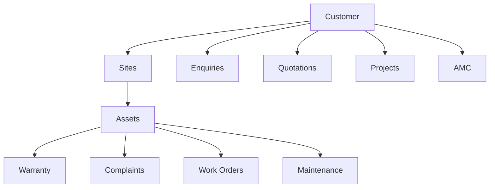

## `MEMORY.md`

```md
# Airmech One — Project Memory

**Product:** Airmech One  
**Built by:** Qeilvra  
**Client:** Airmech Oman

This file stores confirmed project facts, important decisions, constraints, assumptions, and unresolved questions.

Do not use this file for temporary coding notes.

---

# 1. Permanent Product Rule

**Software speed must never be compromised.**

This applies to:

- Desktop
- Mobile
- API
- Database
- Search
- Dashboard
- Reports
- Documents
- Automations

A feature is not complete if it noticeably slows a core workflow.

---

# 2. Product

Airmech One is a custom internal Operations Management System for Airmech Oman.

It combines:

```text
CRM
+
Enquiries
+
Quotations
+
Projects
+
Customers
+
Equipment / Assets
+
Warranty
+
Complaints
+
Engineer Management
+
Work Orders
+
AMC
+
Preventive Maintenance
+
Service Reports
+
Documents
+
Reports
+
Automation
```

It is NOT only a CRM or complaint-management application.

---

# 3. Main Business Flow

```text
Enquiry
↓
RFQ / Requirement
↓
Quotation
↓
Follow-up
↓
Project / Order
↓
Installation
↓
Equipment Registration
↓
Warranty / AMC
↓
Complaint / Preventive Maintenance
↓
Engineer Assignment
↓
Work Order
↓
Diagnosis / Repair
↓
Customer Confirmation
↓
Service Report
↓
Asset History
↓
Future Maintenance / Renewal
```

---

# 4. Confirmed Client Requirements

The client has requested:

- enquiry management
- customer records
- customer reports
- multiple employee logins
- multiple engineer logins
- complaint management
- complaint status tracking
- pending/resolved visibility
- warranty / guarantee handling
- engineer assignment
- engineer work tracking
- management visibility
- operational data storage
- backups
- automation

Approximate discussion:

```text
~10 engineers
~20 additional employees/users
```

Exact active/concurrent user count must still be confirmed.

---

# 5. Target Users

Current expected roles:

```text
Super Admin
Management
Sales / Admin
Service Manager
Engineer / Technician
Project Manager
Accounts
Store / Inventory
```

Phase 2 may include:

```text
Customer Portal User
```

---

# 6. Main Product Principle

Every important business record should remain connected.

Example:

```text
Customer
├── Contacts
├── Sites
│   └── Equipment
│       ├── Warranty
│       ├── Complaints
│       ├── Work Orders
│       └── Maintenance History
│
├── Enquiries
├── Quotations
├── Projects
├── AMC
└── Documents
```

Staff changes must not cause operational history to disappear.

---

# 7. Desktop + Mobile Decision

Desktop and mobile use the same backend and business data.

Mobile must have the same permitted business capabilities as desktop.

However:

**Mobile must NOT simply be the desktop interface stacked vertically.**

Mobile should use:

- bottom navigation
- tabs
- drill-down screens
- drawers
- bottom sheets
- sticky actions
- compact cards
- mobile-specific lists
- full-screen search
- mobile filters

---

# 8. Current Technical Direction

Recommended architecture:

```text
Frontend
Next.js + TypeScript

Backend
NestJS + TypeScript

Database
PostgreSQL

Background Jobs
Redis / BullMQ

Files
Private Object Storage

Repository
pnpm monorepo
```

This is the current engineering direction, not a client requirement.

If changed, record why.

---

# 9. Phase 1

Phase 1 should provide a fully usable operational product.

Included:

```text
Authentication
RBAC
Users

Dashboard

Customers
Contacts
Sites

Enquiries
RFQs
Quotations

Projects

Assets / Equipment
Warranty

Complaints
SLA

Engineers
Dispatch
Work Orders

Engineer Mobile Experience

AMC
Preventive Maintenance

Service Reports
Documents

Notifications
Search
Reports
Audit Logs

Backup / Recovery

Core Automations
```

---

# 10. Phase 2

Potential expansion:

```text
Inventory
Spare Parts

Procurement
Suppliers

Customer Portal

WhatsApp Business API

Accounting / ERP Integration

Advanced AI

Advanced Analytics

BMS / IoT
```

Do not move Phase 2 features into Phase 1 without approval.

---

# 11. Automation Direction

Use deterministic workflow automation before AI.

Examples:

```text
Enquiry overdue
→ reminder

Still overdue
→ manager escalation

Quotation sent
→ follow-up reminder

Complaint created
→ SLA begins

High priority complaint
→ service manager alert

Engineer assigned
→ engineer notification

AMC visit due
→ work order generated

AMC expiring
→ renewal action

Work completed
→ service report generated
```

---

# 12. AI Direction

AI is optional and secondary.

Potential later uses:

- complaint classification
- priority suggestion
- RFQ extraction
- customer-history summary
- engineer-note → report drafting
- repeated-failure detection
- management summary

AI must not autonomously:

- approve quotations
- approve warranty claims
- make safety-critical engineering decisions
- delete business records

---

# 13. Performance Decisions

Always use:

- server-side pagination
- server-side filtering
- server-side sorting
- database indexes
- small API payloads
- lazy loading
- route splitting
- background jobs
- optimized mobile payloads

Heavy tasks must not block users:

```text
PDF
Excel
Email
WhatsApp
AI
Imports
Large Reports
Image Processing
Scheduled Automation
```

---

# 14. Security Decisions

Required:

- individual accounts
- server-side permissions
- object-level authorization
- secure password hashing
- protected documents
- audit trail
- secret management
- backups
- restore testing

Frontend permission hiding is not security.

---

# 15. Important Unknowns

The following are NOT confirmed yet:

- exact number of production users
- exact concurrent usage
- existing CRM
- existing accounting/ERP software
- exact quotation approval hierarchy
- exact complaint intake channels
- exact SLA rules
- warranty rules by product/brand
- exact AMC frequencies
- existing service-report format
- historical data volume
- migration format
- inventory requirements
- WhatsApp Phase 1 or Phase 2
- customer portal timing
- BMS API availability
- backup RPO/RTO requirements

Do not invent answers.

---

# 16. Discovery Questions

Before final implementation decisions, confirm:

1. What systems does Airmech currently use?
2. What roles exist?
3. What can each role view/change?
4. How is an enquiry currently handled?
5. How is a quotation approved?
6. How are complaints received?
7. How is complaint priority determined?
8. How is warranty eligibility determined?
9. How are engineers assigned?
10. What fields exist in current service reports?
11. How are AMC schedules created?
12. What historical data needs migration?
13. Which integrations are required at launch?

---

# 17. Memory Update Rule

Update this file when:

- client confirms a requirement
- scope changes
- Phase 1/2 changes
- architecture decision changes
- important workflow is approved
- new permanent constraint is discovered

Do NOT turn assumptions into confirmed facts.

---

# 18. Current Product Identity

```text
AIRMECH ONE

Operations Management System

Built by Qeilvra
```
```

---

## `PRD.md`

```md
# Airmech One — Product Requirements Document

**Product:** Airmech One  
**Built by:** Qeilvra  
**Client:** Airmech Oman  
**Type:** Operations Management System

---

# 1. Product Definition

Airmech One is a centralized operations platform that connects Airmech's commercial, project, customer-service, engineering, equipment, warranty, complaint and maintenance operations.

The product creates one operational system covering the customer lifecycle from first enquiry through long-term equipment maintenance.


---

# 2. Product Goal

Airmech One should allow management to quickly answer:

```text
Who is the customer?

What did they request?

Was a quotation sent?

Who needs to follow up?

What projects are active?

What equipment is installed?

Is the equipment under warranty?

Is there an active AMC?

What complaints are open?

Which engineer is assigned?

What work was completed?

What requires attention?

When is the next service?

When does the AMC expire?
```

Without contacting multiple employees or searching different systems.

---

# 3. Problem We Are Solving

Operational information can become fragmented across:

- calls
- WhatsApp
- email
- spreadsheets
- documents
- paper
- individual employees

This creates operational risk.

---

# 4. Problem — Missed Enquiries

An enquiry can be forgotten when:

- ownership is unclear
- next action is missing
- follow-up is not scheduled

### Solution

Every enquiry receives:

```text
Customer
Owner
Priority
Status
Next Action
Follow-up Date
History
```

---

# 5. Problem — Missed Quotation Follow-up

Sending a quotation does not guarantee follow-up.

### Solution

```text
Quotation Sent
      ↓
Follow-up Date
      ↓
Reminder
      ↓
Still Pending?
      ↓
Escalation
```

---

# 6. Problem — Fragmented Customer Records

Customer information may exist in multiple places.

### Solution

Create one Customer 360 profile.



---

# 7. Problem — Complaint Visibility

Management needs to know whether a complaint is:

```text
New
Assigned
Scheduled
On Site
In Progress
Waiting for Part
Resolved
Confirmed
Closed
```

### Solution

A controlled complaint workflow:


---

# 8. Problem — Engineer Coordination

Engineer activity needs centralized visibility.

### Solution

The system manages:

- engineer availability
- skills
- current workload
- assigned jobs
- schedule
- site visits
- work status
- job completion

---

# 9. Problem — Lost Equipment History

Equipment may be maintained for many years.

Operational knowledge should not disappear when employees change.

### Solution

Every asset receives a permanent history.

Example:

```text
Asset
CH-03

Customer
ABC Hotel

Equipment
Water-Cooled Chiller

Brand
Trane

Installation
12 Jan 2026

Warranty
Active

AMC
Active

Last Service
12 Sep 2026

Next PM
12 Dec 2026

Complaints
4 historical
1 open
```

---

# 10. Problem — Preventive Maintenance

Maintenance should not depend on employees remembering dates manually.

### Solution


---

# 11. Problem — Management Visibility

Management should not need to repeatedly ask staff:

```text
What is pending?

Which complaint is late?

Which engineer is free?

Which quotation needs follow-up?

Which AMC is expiring?
```

### Solution

Management dashboard showing exceptions and work needing attention.

---

# 12. Target Users

## Management

Needs:

- company overview
- operational KPIs
- escalations
- reports
- workload
- overdue work
- AMC visibility
- project visibility

---

## Sales / Admin

Needs:

- customers
- enquiries
- RFQs
- quotations
- follow-ups
- commercial history

---

## Service Manager

Needs:

- complaints
- SLA
- warranty
- engineer availability
- dispatch
- work orders
- AMC
- preventive maintenance

---

## Engineer / Technician

Needs:

- today's jobs
- customer
- site
- equipment
- asset history
- complaint
- instructions
- diagnosis
- readings
- photos
- parts
- notes
- customer signature
- completion

---

## Project Manager

Needs:

- active projects
- team
- milestones
- tasks
- progress
- issues
- documents
- handover

---

## Accounts

May access approved:

- quotations
- commercial records
- payment-related information

Exact scope requires confirmation.

---

## System Admin

Needs:

- users
- roles
- permissions
- system configuration
- audit
- security administration

---

# 13. Product Scope — Phase 1

Phase 1 includes:

## Platform

- Authentication
- Users
- Roles
- Permissions
- Audit Logs

## Management

- Dashboard
- Notifications
- Search
- Reports

## Customer

- Customers
- Contacts
- Sites
- Customer 360

## Commercial

- Enquiries
- RFQs
- Quotations
- Revisions
- Follow-ups

## Projects

- Projects
- Milestones
- Tasks
- Documents
- Issues
- Handover

## Equipment

- Asset Registry
- Warranty
- Asset History

## Service

- Complaints
- SLA
- Engineer Dispatch
- Work Orders
- Engineer Mobile Interface

## Maintenance

- AMC Contracts
- Preventive Maintenance
- Maintenance Calendar
- Renewal Alerts

## Reporting

- Service Reports
- PDF generation
- Excel/CSV export where needed

## Infrastructure

- File Storage
- Backups
- Recovery
- Monitoring
- Core Automation

---

# 14. Phase 2 Scope

Potential Phase 2:

```text
Inventory

Spare Parts

Procurement

Suppliers

Customer Portal

WhatsApp Business API

Accounting / ERP Integration

Advanced AI

Advanced Analytics

BMS / IoT Integration
```

---

# 15. Mobile Product Requirement

Mobile is NOT a reduced version of Airmech One.

Users should retain the same capabilities permitted by their role.

However:

**Mobile must not simply stack desktop vertically.**

Use:

- bottom navigation
- drill-down screens
- tabs
- bottom sheets
- drawers
- sticky actions
- compact lists
- mobile cards
- full-screen search
- full-screen filters

Example:

```text
Desktop

Complaint List
|
Complaint Detail
|
Engineer Panel
```

becomes:

```text
Mobile

Complaint List
     ↓
Complaint
     ↓
Overview | Timeline | Work Orders | Asset
     ↓
Sticky Actions
```

---

# 16. Performance Requirement

Performance is a core product requirement.

**Do not compromise software speed.**

Use:

- pagination
- filtering
- sorting
- indexes
- lazy loading
- route splitting
- small API payloads
- background workers
- optimized mobile requests

Do not:

- fetch full tables
- preload unnecessary histories
- run large exports synchronously
- block users while generating PDFs
- block business transactions while sending notifications
- add unnecessary frontend dependencies

---

# 17. Performance Targets

Engineering targets:

```text
Common API reads
p95 < 300ms where practical

Normal filtered lists
< 700ms target

Global search
Useful results < 1 second

Dashboard
Critical content available quickly

Large reports
Asynchronous

PDF generation
Asynchronous
```

These are engineering targets until actual infrastructure and production volumes are confirmed.

---

# 18. Desktop Requirement

Desktop should prioritize:

```text
Operational visibility
Tables
Split views
Filters
Fast search
Multi-column information
Management overview
```

---

# 19. Mobile Requirement

Mobile should prioritize:

```text
Current task
Next action
Quick search
Job execution
Customer/site access
Equipment information
Fast updates
Photo capture
Signature
```

---

# 20. Core Automations

## Enquiry

```text
New Enquiry
→ Owner Assigned
→ Next Action
→ Reminder
→ Escalation if overdue
```

## Quotation

```text
Quotation Sent
→ Follow-up
→ Reminder
→ Expiry Warning
```

## Complaint

```text
Complaint Created
→ SLA Starts
→ Priority Check
→ Engineer Assignment
→ SLA Warning
→ Escalation
```

## AMC

```text
AMC Contract
→ PM Schedule
→ Work Orders
→ Maintenance Visits
→ Renewal Reminder
```

## Work Order

```text
Work Completed
→ Save Field Data
→ Queue Service Report
→ Generate PDF
→ Update Asset History
```

---

# 21. Search

Global search should find:

```text
Customer
Contact
Phone
Email
Enquiry
Quotation
Project
Complaint
Work Order
Asset
Serial Number
Engineer
AMC
```

Exact identifiers should rank strongly.

---

# 22. Reports

Required reporting areas:

## Commercial

- enquiry pipeline
- pending follow-up
- quotation conversion
- won/lost

## Service

- complaint backlog
- SLA
- resolution time
- repeat complaints

## Engineers

- workload
- completed work
- response time
- first-time fix where measurable

## Assets

- service history
- recurring failures
- warranty expiry

## AMC

- upcoming PM
- completed PM
- overdue PM
- expiring contracts
- renewals

---

# 23. Security

Required:

- secure authentication
- server-side authorization
- role permissions
- object-level access
- private documents
- audit trail
- secure secrets
- backups
- recovery testing

---

# 24. Out of Scope for Initial Release

Unless separately approved:

```text
Payroll
Full HR System
Full Accounting Ledger
Tax Filing
Advanced Warehouse Management
Fleet Tracking
Biometric Attendance
Autonomous Engineering Decisions
Autonomous Warranty Decisions
```

---

# 25. Success Criteria

Airmech One succeeds when:

- every enquiry has ownership
- quotations are followed up
- customer history is centralized
- equipment history is preserved
- complaints are traceable
- engineers can execute jobs from mobile
- management sees work needing attention
- AMC visits are generated automatically
- service reports are easily available
- permissions protect business data
- backups can be restored
- the system remains fast as data grows

---

# 26. Final Product Principle

```text
One customer
One operational history
One equipment history
One service workflow
One management view
```

Airmech One should reduce manual follow-up, improve operational visibility, preserve company knowledge, and make day-to-day work easier without compromising software speed.
```

**Difference:** `MEMORY.md` tells Codex **what we already know and what must not be assumed**. `PRD.md` tells it **what Airmech One must achieve as a product**.

## Confirmed access decisions — 6 October 2026

The approved Phase 1 role baseline, engineer assignment scope, Super Admin-only security mutation and Management read-only inspection are recorded in docs/decisions/012-authorization-baseline.md. Development origin/callback/reset are configurable and approved as http://localhost:3000, /auth/callback and /auth/reset-password. Temporary real Supabase identity verification and exact cleanup were expressly authorized by the owner. Production identity/origins/SMTP/deployment remain future configuration.

Service Manager customer/site operational field edits, commercial/legal/financial read-only fields and archive/merge prohibition are confirmed in docs/decisions/013-customer-operational-access.md. Project Manager cannot create standalone customers; access requires an existing managed project and project-relevant operational context. Those documents supersede older missing-access-policy statements; they do not claim that customer/project enforcement exists.

Warranty routing is confirmed as active warranty, else active AMC, else paid service. Overrides require authorized user/reason/time/audit. Product coverage, quotation approval thresholds/hierarchy, SLA hours/calendars, actual per-contract AMC frequencies and contractual backup RPO/RTO remain unconfirmed; configurable structures are allowed without inventing production values.
