# `PRD.md`

```md
# Airmech Operations Management System
## Product Requirements Document

**Product owner / developer:** Qeilvra  
**Client:** Airmech Oman  
**Product type:** Internal Operations Management Platform

---

## 1. Product Overview

The Airmech Operations Management System is a custom business operations platform designed to connect Airmech's commercial, engineering, customer-service, equipment, complaint, warranty, project, and maintenance operations.

It is not only:

- a CRM
- a complaint system
- a project tracker
- an engineer app
- an AMC system

It combines all of these into one connected operational platform.


---

## 2. Main Business Problem

Airmech has multiple operational processes that can become fragmented across:

- phone calls
- WhatsApp
- emails
- spreadsheets
- paper records
- employee memory
- separate documents
- different departments

This creates risks such as:

- enquiries being forgotten
- quotations not followed up
- complaints not properly tracked
- unclear engineer assignment
- poor visibility for management
- lost equipment history
- missed preventive maintenance
- warranty information being difficult to check
- customer data being spread across multiple places
- lack of reliable audit history

The software solves this by giving Airmech one central operating system.

---

## 3. Main Problems We Solve

### 3.1 Enquiry Management

Every enquiry should have:

- customer
- source
- owner
- priority
- status
- next action
- follow-up date

No enquiry should exist without clear ownership.

---

### 3.2 Quotation Follow-up

Quotation lifecycle:

```text
Draft
→ Approved
→ Sent
→ Follow-up
→ Negotiation
→ Accepted / Rejected / Expired
```

The system automatically reminds the responsible employee when follow-up is due.

---

### 3.3 Customer Information

Each customer receives one complete profile containing:

- contacts
- sites
- enquiries
- quotations
- projects
- equipment
- complaints
- warranty
- AMC
- service history
- documents

---

### 3.4 Complaint Management

A complaint must be traceable from the moment it arrives until it is actually closed.


---

### 3.5 Engineer Operations

Engineers require their own login.

They should be able to:

- see assigned jobs
- see customer/site
- see equipment history
- start work
- add diagnosis
- upload photos
- add measurements
- record parts
- request parts
- add recommendations
- take customer signature
- resolve jobs
- complete work orders

---

### 3.6 Equipment History

Every important equipment item should have a permanent digital record.

Example:

```text
Asset: CH-03
Customer: ABC Hotel
Site: Main Plant Room
Type: Water-Cooled Chiller
Serial: TRN-XXXX-2901
Warranty: Active
AMC: Active
Last Service: 12 Sep 2026
Next PM: 12 Oct 2026
Open Complaints: 1
```

---

### 3.7 AMC / Preventive Maintenance

The system should automatically generate future preventive-maintenance visits.


---

## 4. Target Users

| User | Main Requirement |
|---|---|
| Management | Operational overview, reports, escalations |
| Sales/Admin | Enquiries, customers, quotations |
| Service Manager | Complaints, engineers, work orders |
| Engineer | Field jobs and service updates |
| Project Manager | Projects, milestones, documents |
| Accounts | Approved commercial/payment information |
| Store | Inventory in Phase 2 |
| System Admin | Users, permissions, settings |
| Customer | Portal in Phase 2 |

---

## 5. Phase 1 Scope

Phase 1 must be a complete usable operational product.

Modules:

1. Authentication
2. Roles & Permissions
3. Management Dashboard
4. Customers
5. Customer Sites
6. Enquiries
7. RFQs
8. Quotations
9. Projects
10. Equipment / Assets
11. Warranty
12. Complaints
13. Engineer Dispatch
14. Work Orders
15. Engineer Mobile Interface
16. AMC
17. Preventive Maintenance
18. Service Reports
19. Documents
20. Notifications
21. Reports
22. Audit Logs
23. Search
24. Backups
25. Basic Automation

---

## 6. Phase 2

Possible Phase 2 modules:

- inventory
- spare parts
- procurement
- suppliers
- customer portal
- WhatsApp Business API
- accounting integration
- advanced analytics
- AI assistance
- BMS / IoT integration

---

## 7. Mobile Requirement

Mobile must support the same business capabilities as desktop where role permissions allow.

Mobile must NOT simply stack the desktop interface vertically.

Use:

- bottom navigation
- tabs
- drawers
- drill-down screens
- sticky actions
- accordions
- horizontal KPI scrolling
- dedicated detail screens
- full-screen search
- full-screen filters

Example:

```text
Complaint List
      ↓
Complaint Details
      ↓
Overview | Timeline | Work Orders | Asset | Documents
      ↓
Assign | Update | Resolve
```

---

## 8. Performance Requirement

Software speed is NON-NEGOTIABLE.

Do not sacrifice speed for:

- animations
- excessive UI effects
- unnecessary libraries
- large datasets loaded at once
- convenience shortcuts

Requirements:

- server-side pagination
- server-side filtering
- server-side sorting
- indexed database queries
- lazy-loaded modules
- background jobs for heavy tasks
- optimized mobile payloads
- no unnecessary API responses

Target:

```text
Common API p95: < 300ms where practical
Search: < 1 second
Dashboard: usable quickly
Tables: paginated
Heavy work: asynchronous
```

A feature is not complete if it noticeably slows down core operations.

---

## 9. Success Criteria

The product succeeds when:

- enquiries are not forgotten
- quotations have next actions
- complaints are traceable
- engineers know exactly what work is assigned
- management sees current operational status
- equipment history remains available
- AMC visits are automatically scheduled
- reports can be generated easily
- data is backed up
- permissions are controlled
- system remains fast as data grows
```

---

# `FEATURES.md`

```md
# Airmech Operations Management System
## Functional Features

> Performance rule: every feature must remain fast with growing data. Do not load complete historical datasets where pagination or lazy loading can be used.

---

## 1. Authentication

Features:

- login
- logout
- password reset
- user activation
- user deactivation
- session management
- optional admin 2FA

---

## 2. Roles & Permissions

Roles:

```text
Super Admin
Management
Sales/Admin
Service Manager
Engineer
Project Manager
Accounts
Store
Customer
```

Permissions must be enforced server-side.

---

## 3. Dashboard

Show:

- Open Enquiries
- Pending Quotations
- Active Projects
- Open Complaints
- High Priority Complaints
- Engineer Jobs
- AMC Due
- Warranty Cases
- Overdue Tasks
- Work Needing Attention
- Recent Activity

Dashboard sections should load independently where possible.

---

## 4. Customers

Functions:

- create customer
- edit customer
- contacts
- sites
- history
- assets
- complaints
- quotations
- projects
- AMC
- documents

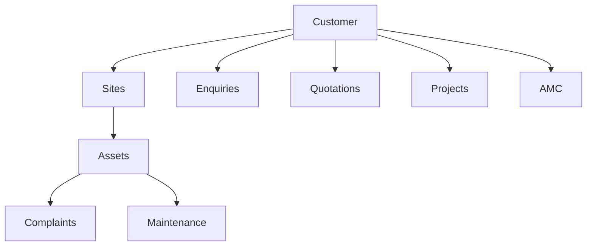

---

## 5. Enquiries

Fields:

- ID
- customer
- contact
- site
- source
- requirement
- owner
- priority
- status
- next action
- follow-up date

Statuses:

```text
New
Qualified
Site Visit
RFQ
Quotation
Negotiation
Won
Lost
```

---

## 6. Quotations

Functions:

- quotation creation
- revisions
- items/services
- price
- tax
- discount
- validity
- warranty
- approvals
- PDF
- follow-up
- accepted/rejected/expired
- convert to project

---

## 7. Projects

Functions:

- project manager
- team
- dates
- milestones
- tasks
- progress
- documents
- site reports
- issues
- handover

---

## 8. Equipment / Assets

Store:

- equipment ID
- site
- type
- brand
- model
- serial
- install date
- warranty
- AMC
- service history
- complaints
- documents

---

## 9. Complaints

Complaint contains:

- customer
- site
- asset
- description
- priority
- category
- warranty
- SLA
- status
- engineer
- documents
- photos
- resolution

---

## 10. Warranty

Functions:

- automatic warranty check
- warranty start/end
- claim record
- authorized override
- documents
- status

---

## 11. Engineers

Functions:

- engineer profile
- skills
- current status
- current workload
- schedule
- assigned jobs

---

## 12. Work Orders

Functions:

- assignment
- schedule
- customer
- site
- asset
- complaint
- instructions
- diagnosis
- readings
- photos
- parts
- recommendations
- signature
- completion

---

## 13. Mobile Engineer App

Must support:

- Today's Jobs
- Upcoming Jobs
- Customer
- Site
- Equipment
- Complaint
- Asset History
- Start Visit
- Add Diagnosis
- Upload Photos
- Record Readings
- Add Parts
- Request Parts
- Add Notes
- Customer Signature
- Resolve
- Escalate
- Complete Job

Mobile must use dedicated mobile interaction patterns, not only vertical stacking.

---

## 14. AMC

Functions:

- AMC customer
- sites
- assets
- contract dates
- maintenance frequency
- schedule
- status
- renewal

---

## 15. Preventive Maintenance

Functions:

- automatically create future visits
- due calendar
- engineer assignment
- customer reminder
- completed visit
- service report
- next visit

---

## 16. Service Reports

Include:

- customer
- site
- equipment
- engineer
- complaint
- diagnosis
- work performed
- parts
- readings
- images
- recommendations
- customer signature
- engineer signature

PDF generation should run asynchronously if necessary.

---

## 17. Documents

Allow secure upload/download for:

- RFQ
- quotation
- PO
- contract
- drawings
- BOQ
- manual
- warranty
- service report
- photos
- commissioning document

---

## 18. Notifications

Phase 1:

- in-app
- email

Phase 2:

- WhatsApp
- SMS if required

---

## 19. Reports

Examples:

- open complaints
- SLA
- average resolution
- engineer workload
- first-time fix
- AMC due
- AMC renewals
- quotations pending
- quotation conversion
- delayed projects
- recurring asset problems

---

## 20. Global Search

Search:

- customers
- phone
- email
- enquiry
- quotation
- project
- complaint
- work order
- asset
- serial number
- AMC
- engineer

Search must use indexed fields and return useful results quickly.
```

---

# `WORKFLOWS.md`

```md
# Airmech Operations Management System
## Business Workflows

> All workflows must remain fast. Heavy notifications, reports, exports, AI work and document generation must run outside the user's main request when possible.

---

## Enquiry Workflow

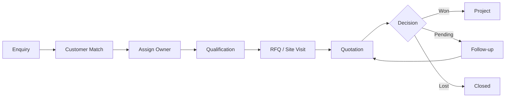

---

## Complaint Workflow

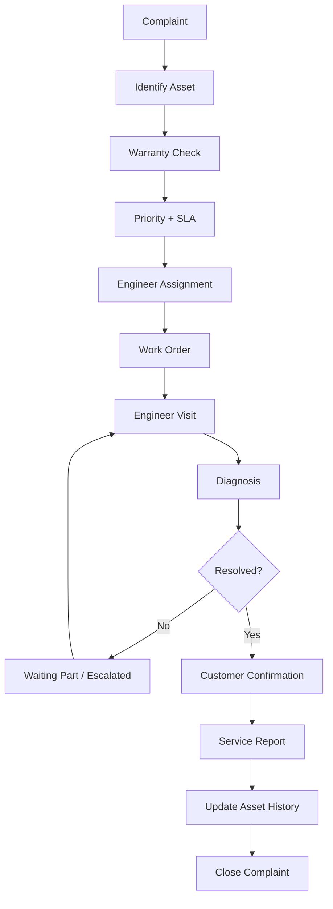

---

## Warranty Workflow

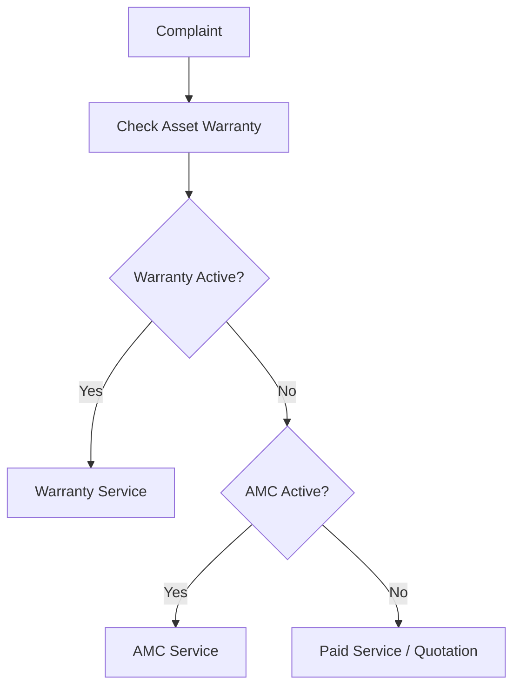

---

## Engineer Workflow

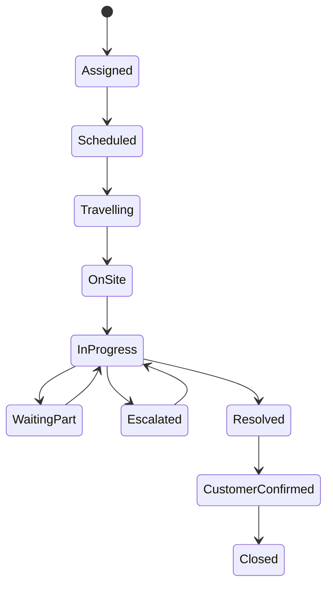

---

## AMC Workflow


---

## Automation Rule

Notifications and reports must not slow down business actions.

Example:

```text
User resolves job
↓
Database saves resolution
↓
User immediately receives success
↓
Background worker generates PDF
↓
Background worker emails customer
```
```

---

# `ARCHITECTURE.md`

```md
# Airmech Operations Management System
## Software Architecture

> Architecture must prioritize maintainability, security and speed.

---

## High-Level Architecture

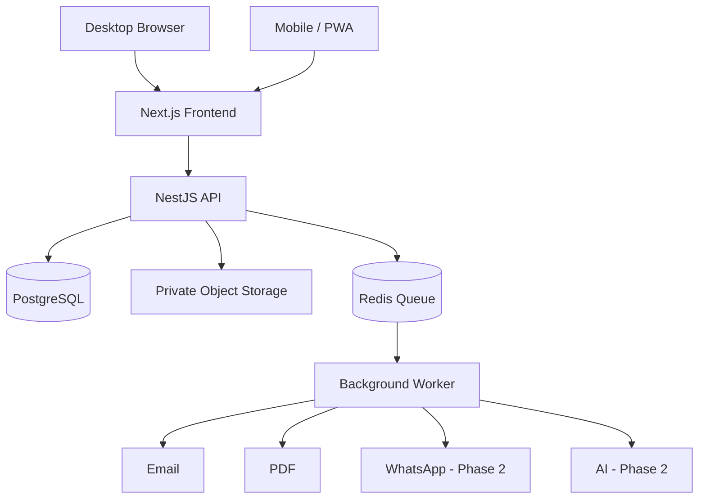

---

## Recommended Folder Structure

```text
airmech-operations/
│
├── apps/
│   ├── web/
│   ├── api/
│   └── worker/
│
├── packages/
│   ├── ui/
│   ├── contracts/
│   ├── database/
│   ├── config/
│   └── testing/
│
├── docs/
│   └── decisions/
│
├── infra/
├── scripts/
├── tests/
│   └── e2e/
│
├── README.md
├── MEMORY.md
├── PRD.md
├── FEATURES.md
├── WORKFLOWS.md
├── ARCHITECTURE.md
├── DESIGN.md
├── RULES.md
├── PERFORMANCE.md
├── SECURITY.md
├── TASK.md
└── ROADMAP.md
```

---

## Frontend Structure

```text
apps/web/src/

app/
├── dashboard/
├── customers/
├── enquiries/
├── quotations/
├── projects/
├── assets/
├── service/
├── engineers/
├── amc/
├── reports/
└── admin/

features/
├── customers/
├── enquiries/
├── quotations/
├── projects/
├── complaints/
├── work-orders/
├── assets/
└── amc/

components/
├── layout/
├── forms/
├── tables/
├── feedback/
└── navigation/

lib/
├── api/
├── auth/
├── query/
└── telemetry/
```

---

## Backend Structure

```text
apps/api/src/modules/

auth/
users/
roles/
customers/
sites/
enquiries/
quotations/
projects/
assets/
complaints/
warranty/
engineers/
work-orders/
amc/
maintenance/
documents/
notifications/
reports/
audit/
```

---

## Dependency Rule

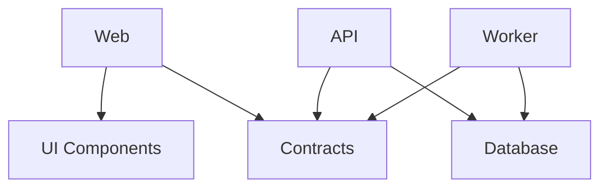

Rules:

```text
Web must NOT access database directly.

UI package must NOT know database entities.

Database package must NOT be imported into browser code.

Business modules own their write rules.

Shared folders must not become dumping grounds.
```

---

## Example Request

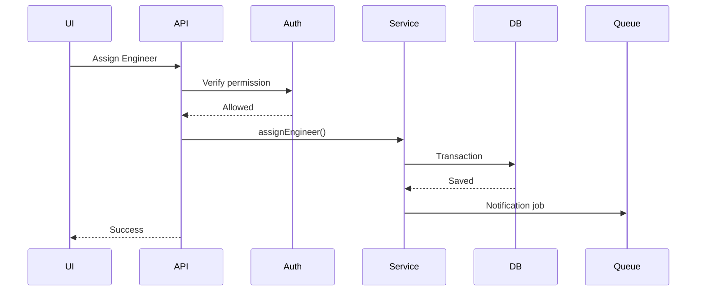

Notification happens later so the user is not forced to wait.

---

## Core Linking

```text
Customer
  └─ Sites
       └─ Assets
            ├─ Warranty
            ├─ Complaints
            ├─ Work Orders
            └─ Maintenance
```

Commercial:

```text
Customer
 └─ Enquiry
     └─ Quotation
         └─ Project
             └─ Asset
```

---

## Performance Architecture Rules

- no direct full-table fetching
- paginate lists
- index common queries
- lazy load large modules
- move heavy work to worker
- avoid N+1
- avoid huge nested APIs
- avoid synchronous email/PDF/AI
```

---

# `DESIGN.md`

```md
# Airmech Operations Management System
## Qeilvra Design System

> Visual design must never reduce software speed or operational clarity.

---

## Visual Direction

The interface should feel:

```text
Industrial
Professional
Operational
Modern
Dense but readable
Precise
Fast
Calm
```

Avoid generic AI SaaS styling.

---

## Primary Colors

```css
--navy-900: #0B2230;
--teal-700: #0F7484;
--teal-100: #E6F2F4;

--background: #F5F8F9;
--surface: #FFFFFF;

--text-primary: #14242C;
--text-secondary: #62757E;

--border: #D7E1E5;
```

---

## Semantic Colors

```css
--success: #246B56;
--success-bg: #EAF6F1;

--warning: #7A450D;
--warning-bg: #FFF3E6;

--error: #A33B3B;
--error-bg: #FDEEEE;

--info: #2F6F8F;
--info-bg: #EAF4F8;
```

Never use color alone to communicate status.

---

## Typography

Use system fonts for speed.

```css
font-family:
  system-ui,
  -apple-system,
  BlinkMacSystemFont,
  "Segoe UI",
  Arial,
  sans-serif;
```

Typography:

```text
Page Title       28px / 700
Section Title    20px / 650
Card Title       16px / 600
Body             14–15px
Table            13–14px
Helper Text      12px
```

---

## Desktop Structure

```text
┌─────────────────────────────────────────────┐
│ Header / Search / Notifications / User      │
├───────────┬─────────────────────────────────┤
│ Sidebar   │ Page Content                    │
│           │                                 │
│ Dashboard │ Filters                         │
│ Customers │ KPIs                            │
│ Service   │ Tables                          │
│ Assets    │ Details                         │
│ AMC       │                                 │
└───────────┴─────────────────────────────────┘
```

---

## Mobile Structure

Mobile must NOT be only vertical desktop.

Example:

```text
┌───────────────────┐
│ Qeilvra      🔔   │
├───────────────────┤
│ Current Job       │
│                   │
├───────────────────┤
│ Overview | Asset  │
│ Work | Timeline   │
├───────────────────┤
│ Detail Content    │
├───────────────────┤
│ Sticky Actions    │
├───────────────────┤
│ Home Jobs Search  │
│ Customers More    │
└───────────────────┘
```

Use:

- tabs
- bottom navigation
- drawers
- sheets
- detail pages
- sticky buttons
- compact cards
- horizontally scrollable KPIs

---

## Buttons

Good:

```text
Create Complaint
Assign Engineer
Generate Report
Save Changes
Resolve Complaint
Complete Job
```

Avoid vague:

```text
Submit
Proceed
Click Here
```

---

## Forms

- visible labels
- preserve input after validation
- show error beside field
- do not use placeholder as only label
- keyboard accessible
- clear required fields

---

## Tables

- server-side pagination
- sorting
- filtering
- sticky header
- clear statuses
- compact spacing
- loading state
- empty state

---

## Avoid

Do not use:

- purple gradients
- excessive gradients
- glassmorphism
- liquid glass
- neon
- radial orbs
- dot grids
- oversized rounded cards
- pill buttons
- giant shadows
- emoji icons
- fake metrics
- fake testimonials
- excessive animation
- cursor animations
- decorative charts
- giant whitespace
```

---

# `PERFORMANCE.md`

```md
# Airmech Operations Management System
## Performance Standards

Performance is part of product correctness.

A feature that works but makes the system slow is NOT complete.

---

## Targets

```text
Common API p95       ≤ 300ms where practical
Filtered Table       ≤ 700ms
Search               ≤ 1 second
LCP                   ≤ 2.5s target
INP                   ≤ 200ms target
CLS                   ≤ 0.1
```

---

## Frontend

Required:

- route splitting
- lazy loading
- pagination
- debounce search
- no full datasets
- no unnecessary global state
- optimized assets
- image compression
- loading states

Avoid:

```text
Fetching 10,000 rows
Loading hidden tabs
Large JS dependencies
Large icon libraries
Heavy charts before needed
```

---

## Database

Use proper indexes.

Likely indexed fields:

```text
customer name
customer code
phone
email
asset code
serial number
complaint status
priority
assigned engineer
quotation status
follow-up date
AMC expiry
maintenance date
```

---

## Dashboard

Do not do:

```text
Dashboard
→ 30 sequential queries
→ one huge API response
```

Prefer:

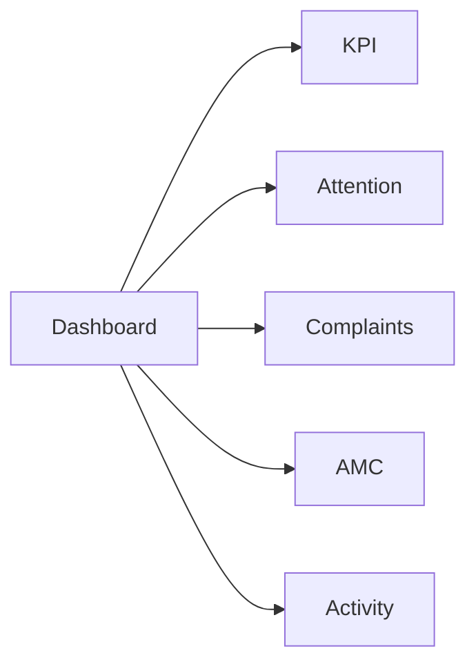

---

## Background Jobs

Run asynchronously:

- PDF
- Excel
- email
- WhatsApp
- AI
- imports
- image processing
- AMC generation
- large reports

---

## Mobile Performance

Engineers may have weak mobile internet.

Therefore:

- small payloads
- compressed photos
- retry support
- save typed notes
- do not load full equipment history automatically
```

---

# `SECURITY.md`

```md
# Airmech Operations Management System
## Security Requirements

Security must remain strong without unnecessarily slowing normal operations.

---

## Authentication

Use:

- individual accounts
- password hashing
- session expiration
- password reset
- account disable
- admin MFA recommended

No shared engineer accounts.

---

## Authorization

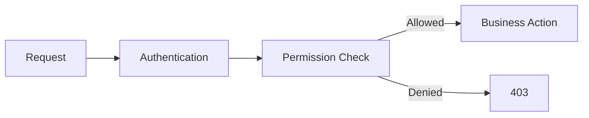

Permissions must be enforced on backend.

---

## Example Permissions

```text
customer.read
customer.write

quotation.create
quotation.approve

complaint.create
complaint.assign
complaint.resolve
complaint.close

workorder.read
workorder.update_own

asset.read
asset.write

report.export

admin.users
```

---

## Audit Logs

Track:

- user
- action
- entity
- entity ID
- timestamp
- previous value
- new value

Important actions:

- quotation approved
- complaint assigned
- warranty overridden
- complaint closed
- work order completed
- user permission changed

---

## Documents

Documents must be private by default.

Validate:

- file type
- file size
- permissions

Do not expose permanent public URLs for confidential files.

---

## Secrets

Never commit:

```text
DATABASE_PASSWORD
JWT_SECRET
EMAIL_API_KEY
WHATSAPP_KEY
AI_API_KEY
STORAGE_SECRET
```

---

## Backups

Required:

- automatic DB backups
- retention policy
- recovery process
- restore testing
- document-storage redundancy

A backup is not trusted until restoration is tested.
```

---

# `RULES.md`

```md
# Airmech Operations Management System
## Engineering Rules

These rules apply to developers and AI coding agents.

Performance must never be compromised to finish work faster.

---

## Before Coding

Always:

1. Read MEMORY.md
2. Read PRD.md
3. Read TASK.md
4. Read relevant FEATURES.md
5. Check WORKFLOWS.md
6. Check ARCHITECTURE.md
7. Check PERFORMANCE.md
8. Check SECURITY.md
9. Check DESIGN.md
10. Inspect existing code

Do not start coding blindly.

---

## Do

- TypeScript strict
- server-side permissions
- input validation
- database constraints
- pagination
- indexes
- transactions
- stable error codes
- tests
- audit important actions
- background jobs
- clear module ownership

---

## Avoid

Never:

- use `any` everywhere
- ignore TypeScript errors
- swallow exceptions
- expose stack traces
- commit secrets
- fetch full DB tables
- create N+1 queries
- duplicate existing components
- rewrite working code unnecessarily
- delete data without reason
- compromise performance
- rely on frontend permissions
- create mobile as only vertical desktop

---

## Error Solving

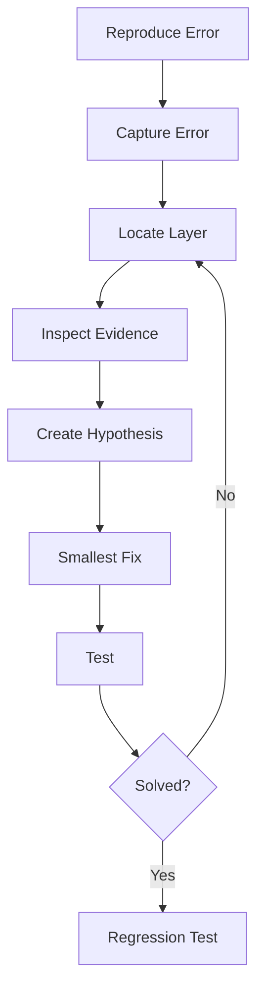

Do not randomly modify code until errors disappear.

---

## User Errors

Bad:

```text
Something went wrong.
```

Good:

```text
The work order could not be assigned because Engineer A is unavailable.
Choose another engineer or change the schedule.
```

---

## Retry

Retry only temporary errors.

Possible:

- email provider timeout
- storage timeout
- AI provider timeout

Do not retry:

- invalid input
- permission denied
- business-rule conflict

---

## Git

Branches:

```text
feat/complaint-assignment
fix/amc-duplicate-jobs
perf/customer-search
security/document-access
```

Commits:

```text
feat(complaints): add engineer assignment
fix(amc): prevent duplicate maintenance jobs
perf(search): add asset serial index
```

---

## Definition of Done

A task is complete only when:

- requirement works
- tests pass
- permissions work
- errors handled
- UI matches design
- performance acceptable
- data safe
- no secrets exposed
- TASK.md updated
```

---

# `TASK.md`

```md
# Airmech Operations Management System
## Development Tasks

Performance is checked at every stage.

---

## States

```text
BACKLOG
READY
IN_PROGRESS
BLOCKED
REVIEW
DONE
```

---

## Phase 0 — Foundation

- [ ] Create workspace
- [ ] Create frontend
- [ ] Create API
- [ ] Create worker
- [ ] PostgreSQL
- [ ] Redis
- [ ] Object storage
- [ ] TypeScript strict
- [ ] Lint
- [ ] Testing
- [ ] CI

---

## Phase 1 — Authentication

- [ ] User model
- [ ] Roles
- [ ] Permissions
- [ ] Login
- [ ] Logout
- [ ] Password reset
- [ ] Admin users
- [ ] Auth tests

---

## Phase 2 — Customers

- [ ] Customers
- [ ] Contacts
- [ ] Sites
- [ ] Customer 360
- [ ] Search
- [ ] Pagination

---

## Phase 3 — Commercial

- [ ] Enquiries
- [ ] RFQs
- [ ] Quotations
- [ ] Revisions
- [ ] PDF
- [ ] Follow-up automation
- [ ] Won/Lost
- [ ] Project conversion

---

## Phase 4 — Projects

- [ ] Projects
- [ ] Milestones
- [ ] Tasks
- [ ] Progress
- [ ] Documents
- [ ] Handover

---

## Phase 5 — Assets

- [ ] Asset registry
- [ ] Serial search
- [ ] Warranty
- [ ] Asset timeline
- [ ] Documents

---

## Phase 6 — Service

- [ ] Complaints
- [ ] SLA
- [ ] Engineer assignment
- [ ] Work orders
- [ ] Reopen
- [ ] Resolve
- [ ] Close

---

## Phase 7 — Engineer Mobile

- [ ] My Jobs
- [ ] Job Details
- [ ] Asset
- [ ] Diagnosis
- [ ] Readings
- [ ] Photos
- [ ] Parts
- [ ] Signature
- [ ] Complete Job

---

## Phase 8 — AMC

- [ ] AMC contracts
- [ ] PM schedules
- [ ] PM work orders
- [ ] Calendar
- [ ] Renewal automation

---

## Phase 9 — Reports

- [ ] Service reports
- [ ] Management reports
- [ ] PDF exports
- [ ] Excel exports

---

## Phase 10 — Hardening

- [ ] Performance tests
- [ ] Security tests
- [ ] Backup restore
- [ ] Permission tests
- [ ] UAT
- [ ] Production deployment
```

---

# `MEMORY.md`

```md
# Airmech Operations Management System
## Project Memory

This file stores durable project facts and decisions.

Do not place temporary development notes here.

Performance and software speed are permanent project requirements.

---

## Confirmed Client Needs

The client requires:

- custom operational software
- enquiry management
- customer data
- customer reports
- complaints
- warranty handling
- engineer management
- multiple logins
- complaint statuses
- data storage
- backups
- management visibility
- automation

Approximately:

```text
10 engineers
20+ employees/users
```

Exact user count must still be confirmed.

---

## Confirmed Product Direction

Product:

**Airmech Operations Management System**

Built by:

**Qeilvra**

System connects:

```text
Customers
Sales
Projects
Equipment
Complaints
Engineers
Warranty
AMC
Maintenance
Documents
Reports
Automation
```

---

## Phase 1

Current Phase 1:

- Authentication
- RBAC
- Dashboard
- Customers
- Sites
- Enquiries
- Quotations
- Projects
- Assets
- Complaints
- Warranty
- Engineers
- Work Orders
- AMC
- Preventive Maintenance
- Service Reports
- Documents
- Notifications
- Reports
- Search
- Audit
- Backup

---

## Phase 2

Potential:

- Inventory
- Procurement
- Suppliers
- Customer Portal
- WhatsApp
- Accounting
- AI
- Advanced Analytics
- BMS / IoT

---

## Permanent Technical Rule

Do not compromise software speed.

This includes:

- desktop
- mobile
- API
- database
- dashboard
- search
- reports

---

## Open Questions

Still confirm with client:

1. Current accounting software?
2. Existing CRM?
3. Exact employee roles?
4. Quotation approval process?
5. Exact complaint intake method?
6. Warranty rules?
7. AMC contract formats?
8. Service report format?
9. Historical data migration?
10. WhatsApp Phase 1 or Phase 2?
11. Inventory needed immediately?
```

---

# `ROADMAP.md`

```md
# Airmech Operations Management System
## Product Roadmap

Each milestone must satisfy performance requirements before moving forward.

---

## Stage 0 — Discovery

Confirm:

- current systems
- employees
- roles
- enquiries
- quotation flow
- complaints
- warranty
- engineers
- AMC
- reporting
- data migration
- integrations

---

## Stage 1 — Foundation

Build:

- authentication
- RBAC
- user management
- customer/site foundation
- audit
- monitoring

---

## Stage 2 — Commercial Operations

Build:

- enquiries
- RFQs
- quotations
- follow-ups
- projects

---

## Stage 3 — Service Operations

Build:

- assets
- warranty
- complaints
- engineers
- work orders
- mobile engineer system

---

## Stage 4 — Maintenance

Build:

- AMC
- preventive maintenance
- service reports
- reminders

---

## Stage 5 — Management

Build:

- dashboard
- reports
- search
- documents
- backups
- audit views

---

## Stage 6 — Go Live

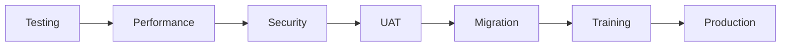

---

## Phase 2

After Phase 1 is stable:

```text
Inventory
Procurement
Supplier Management
Customer Portal
WhatsApp
Accounting Integration
AI
Advanced Analytics
BMS / IoT
```
```

---

# `README.md`

```md
# Airmech Operations Management System

Custom operational software for Airmech Oman.

Built by **Qeilvra**.

---

## Read Documentation In This Order

```text
1. MEMORY.md
2. PRD.md
3. RULES.md
4. DESIGN.md
5. ARCHITECTURE.md
6. PERFORMANCE.md
7. SECURITY.md
8. FEATURES.md
9. WORKFLOWS.md
10. TASK.md
11. ROADMAP.md
```

---

## Product

The system manages:

```text
Enquiry
→ Quotation
→ Project
→ Equipment
→ Warranty
→ Complaint
→ Engineer
→ Work Order
→ Service Report
→ AMC
→ Preventive Maintenance
```

---

## Core Development Rule

> Speed must never be compromised.

Do not trade application performance for:

- animations
- unnecessary libraries
- oversized APIs
- large client-side datasets
- unnecessary UI effects

---

## Recommended Stack

```text
Frontend
Next.js + TypeScript

Backend
NestJS + TypeScript

Database
PostgreSQL

Background Jobs
Redis / BullMQ

Files
Private Object Storage

Workspace
pnpm monorepo
```

---

## Main Applications

```text
apps/
├── web
├── api
└── worker
```

---

## Mobile

Mobile must contain the same permitted business capabilities as desktop.

However:

> Mobile must NOT simply be desktop stacked vertically.

Use task-focused mobile navigation, tabs, drawers, drill-down pages and sticky actions.
```

This gives you a much cleaner foundation for Codex because **PRD defines why**, `FEATURES` defines **what**, `WORKFLOWS` defines **how the business moves**, `ARCHITECTURE` defines **where code belongs**, and `RULES` tells the coding agent **how it is allowed to work**.