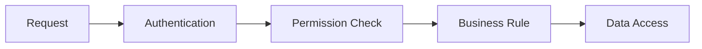
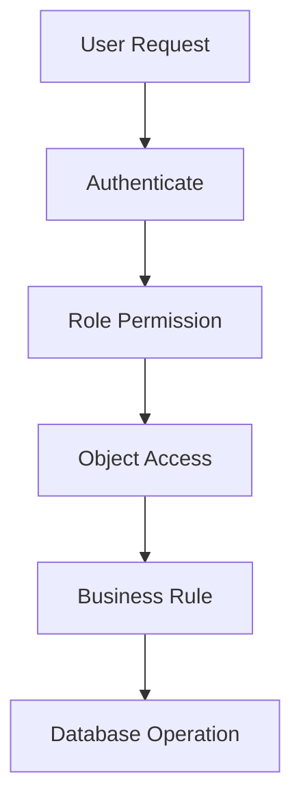

## `SECURITY.md`

```md
# Airmech One — Security & Data Protection

**Product:** Airmech One  
**Built by:** Qeilvra

Security is mandatory.

Security must protect business data without unnecessarily slowing normal work.

---

# 1. Security Objectives

Protect:

- customer data
- contacts
- quotations
- projects
- equipment data
- warranty records
- complaints
- work orders
- engineer data
- AMC records
- service reports
- documents
- user accounts
- audit logs
- integration credentials

---

# 2. Authentication

Every employee must use an individual account.

Required:

- secure password hashing
- login
- logout
- session expiration
- password reset
- account disable
- login monitoring
- admin MFA recommended

Avoid shared user accounts.

Bad:

```text
engineer@airmech.com
shared password
```

Better:

```text
Ahmed Khan
individual account
```

---

# 3. Authorization

Authentication answers:

```text
Who are you?
```

Authorization answers:

```text
What are you allowed to do?
```

Both are required.



---

# 4. Server-Side Permission Rule

Frontend permission checks are only for UI.

Example:

Frontend may hide:

```text
Approve Quotation
```

But backend must still reject unauthorized API calls.

Never rely only on hidden buttons.

---

# 5. Role-Based Access

Possible roles:

```text
Super Admin
Management
Sales/Admin
Service Manager
Engineer
Project Manager
Accounts
Store
```

Permissions should be granular.

Example:

```text
customer.read
customer.write

quotation.create
quotation.approve

complaint.create
complaint.assign
complaint.resolve
complaint.close

workorder.read
workorder.update_own

asset.read
asset.write

report.export

admin.users
```

---

# 6. Object-Level Authorization

Permission alone is not always enough.

Example:

Engineer has:

```text
workorder.read
```

But the system should also check whether that engineer is allowed to access THAT specific work order.

Do not allow users to change URL IDs and access restricted data.

---

# 7. Least Privilege

Users should receive only the permissions required for their job.

Example:

Engineer should not automatically receive:

```text
quotation.approve
admin.users
customer.delete
```

unless explicitly required.

---

# 8. Password Security

Requirements:

- hashed passwords
- never store plain text
- do not log passwords
- do not send passwords back in API responses
- use secure password-reset flow
- reset tokens expire

---

# 9. Sessions

Use secure session handling.

Where applicable:

```text
HttpOnly
Secure
SameSite
```

Session requirements:

- expiry
- logout
- disabled account invalidation
- secure refresh/session handling

---

# 10. Input Validation

Validate all external input.

Examples:

- string length
- IDs
- email
- phone
- dates
- enum values
- file type
- file size
- status transitions

Client validation improves UX.

Backend validation protects the system.

---

# 11. Business Validation

Security also includes preventing invalid actions.

Examples:

```text
Closed complaint cannot be freely reassigned.

Engineer cannot close a complaint without required work data.

Unauthorized user cannot override warranty.

Expired quotation cannot be approved without allowed workflow.
```

---

# 12. Error Security

Users must never receive:

- stack traces
- SQL
- DB connection details
- credentials
- secret keys
- internal paths
- provider secrets

Use:

```json
{
  "error": {
    "code": "PERMISSION_DENIED",
    "message": "You do not have permission to perform this action.",
    "requestId": "req_123"
  }
}
```

Technical details belong in secure logs.

---

# 13. Audit Logging

Audit important actions.

Examples:

```text
LOGIN_FAILED
USER_ROLE_CHANGED

QUOTATION_APPROVED

COMPLAINT_ASSIGNED
COMPLAINT_REOPENED
COMPLAINT_CLOSED

WARRANTY_OVERRIDDEN

WORK_ORDER_COMPLETED

AMC_UPDATED
```

Store:

```text
userId
action
entityType
entityId
before
after
timestamp
requestId
```

---

# 14. Audit Integrity

Normal users must not be able to edit audit history.

Audit records should be append-oriented.

Sensitive audit access should be restricted.

---

# 15. Logging Rules

Log:

- authentication failure
- authorization failure
- important business actions
- unexpected errors
- worker failure
- backup failure
- critical configuration failure

Do NOT log:

- passwords
- tokens
- private keys
- API secrets
- DB passwords
- complete confidential document contents

---

# 16. Document Security

All business documents should be private by default.

Examples:

- RFQ
- quotation
- contract
- PO
- drawings
- warranty certificate
- service report
- customer photos

Access requires authorization.

---

# 17. File Upload Security

Validate:

```text
File size
File type
File extension
Authorized user
Target entity
```

Use generated storage keys.

Do not use raw user filename as storage path.

Avoid dangerous executable uploads.

---

# 18. Private Downloads

Do not expose permanent public document URLs.

Preferred:

```text
User requests document
↓
Permission checked
↓
Short-lived signed URL
↓
Download
```

---

# 19. Secrets Management

Never commit:

```text
DATABASE_URL
DATABASE_PASSWORD
AUTH_SECRET
JWT_SECRET
EMAIL_API_KEY
WHATSAPP_TOKEN
AI_API_KEY
STORAGE_SECRET
```

Secrets belong in secure environment configuration.

---

# 20. Database Security

Use:

- least-privileged application DB user
- TLS where available
- foreign keys
- constraints
- migration review
- restricted production access
- connection security

Do not give the application unnecessary DB admin permissions.

---

# 21. Data Deletion

Important operational records should not be permanently deleted casually.

Prefer:

```text
archive
inactive
soft delete
cancelled
```

Permanent deletion should require explicit permission and business rules.

---

# 22. Backup Strategy

Backups are mandatory.

At minimum:

- automatic DB backup
- backup retention
- separate recovery copy
- file/document redundancy
- backup monitoring
- restore testing

---

# 23. Backup Rule

A backup is not considered reliable until restoration has been tested.

Test:

```text
Can database restore?

Can documents restore?

Can application reconnect?

Is restored data consistent?
```

---

# 24. Recovery

Document:

```text
Who performs recovery?

Where are backups stored?

How is restore initiated?

What data may be lost?

How long does recovery take?
```

Exact RPO/RTO should be confirmed with the client.

Do not promise values before business requirements and infrastructure are agreed.

---

# 25. Authorization Flow



Every layer can reject the action.

---

# 26. CSRF / CORS / Browser Security

Configure according to the authentication architecture.

Consider:

- CSRF protection
- secure CORS
- CSP
- secure cookies
- origin validation

Do not use:

```text
Access-Control-Allow-Origin: *
```

for protected production APIs unless there is a specific reason.

---

# 27. Rate Limiting

Use rate limiting where appropriate for:

- login
- password reset
- public endpoints
- upload endpoints
- sensitive actions

Avoid aggressive rate limits that interfere with normal office use.

---

# 28. API Security

Each protected endpoint must verify:

```text
Authentication
Permission
Object access
Input
Business state
```

Never assume the frontend already checked it.

---

# 29. Search Security

Global search must respect permissions.

Example:

An engineer searching:

```text
ABC Hotel
```

must not automatically gain access to all commercial records.

Search results must be permission-filtered.

---

# 30. Report Security

Reports can contain large amounts of sensitive data.

Control:

- who can run report
- which customers/records are visible
- export permissions
- download access
- report file expiration

---

# 31. Mobile Security

Mobile must use the same security rules as desktop.

Do not weaken permissions because the UI is mobile.

Consider:

- secure sessions
- no secret storage in plain text
- safe cached data
- logout
- device/network failure handling

---

# 32. Background Job Security

Queue jobs may contain identifiers, not unnecessary sensitive data.

Example:

Better:

```text
workOrderId = 123
```

Avoid putting complete customer documents or secrets directly into queue payloads unless required.

---

# 33. External Integration Security

For:

- email
- WhatsApp
- AI
- ERP
- storage

use:

- scoped credentials
- secure secrets
- timeouts
- validation
- restricted permissions
- audit where needed

Integration failure must not corrupt the core business transaction.

---

# 34. AI Security

If AI is added later:

Do not send unnecessary confidential business data.

AI must not autonomously:

- approve warranty
- approve quotations
- change permissions
- delete records
- make safety-critical engineering decisions

Human review remains required.

---

# 35. Dependency Security

Before installing dependencies:

- check maintenance status
- check known vulnerabilities
- check whether actually needed
- review size
- use lockfile
- update carefully

Remove unused packages.

---

# 36. Security Testing

Before production test:

```text
Authentication

Disabled accounts

Role permissions

Object-level authorization

Direct URL/API access

Document access

File uploads

Password reset

Audit logs

Exports

Error leakage

Search permissions
```

---

# 37. Security Release Gate

A release must not ship with known:

- unauthorized data exposure
- broken permissions
- public confidential documents
- leaked secrets
- insecure reset flow
- missing critical audit
- exposed stack traces
- untested backup changes

---

# 38. Security + Performance Rule

Security implementation should be strong but efficient.

Do not create unnecessary repeated permission/database queries.

Where safe:

- batch permission checks
- cache stable permission definitions
- keep authorization logic clear
- avoid huge session payloads

Security must not be removed for speed.

Performance must not be ignored for security implementation.

Both matter.

---

# 39. Final Security Principle

Always prefer:

```text
Deny by default

Least privilege

Server-side authorization

Validated input

Private documents

Audited critical actions

Protected secrets

Tested backups

Safe errors

Measured performance
```

Airmech One should protect company data while remaining fast enough for daily operational use.
```